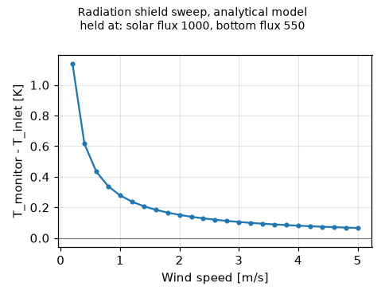

# Studie radiačního štítu — podrobný návod od nuly

Tento návod vás provede celou studií radiačního štítu teploměru: od prvního
odhadu za pár sekund, přes CFD výpočet v tomto programu (SU2), až po stejný
výpočet v **Ansys Student** (Fluent + Workbench + DesignXplorer) a porovnání
obou. Je psaný pro člověka, který **nikdy nedělal CFD** a v Ansysu skoro
neumí — každý pojem se vysvětlí, každý krok říká, kam kliknout a co by
mělo vyjít.

> **Terminologie.** Program i Ansys jsou anglicky, proto uvádím anglický
> název tlačítek a polí tak, jak je uvidíte na obrazovce, a vedle český
> význam.

> **Upřímně na začátek.** Část o programu (A, B) je ověřená na skutečném
> SU2. Část o Ansysu (C) je napsaná podle dokumentace a zkušeností s
> Fluentem, ale autor ji v Ansys Student klik po kliku neprošel — rozvržení
> dialogů se mezi verzemi mírně liší. Proto má každý krok v Ansysu
> **kontrolu**, podle které poznáte, že je nastavený správně, i když dialog
> vypadá trochu jinak (kapitola 7.8).

**Obsah**

1. [O co jde — fyzika bez vzorců](#1-o-co-jde--fyzika-bez-vzorců)
2. [Slovníček](#2-slovníček)
3. [Plán práce a kolik to zabere](#3-plán-práce-a-kolik-to-zabere)
4. [Příprava: software a CAD štítu](#4-příprava-software-a-cad-štítu)
5. [Část A — první odhad za pár sekund](#5-část-a--první-odhad-za-pár-sekund)
6. [Část B — CFD v tomto programu (SU2)](#6-část-b--cfd-v-tomto-programu-su2)
7. [Část C — stejný výpočet v Ansys Student](#7-část-c--stejný-výpočet-v-ansys-student)
8. [Část D — jak dostat co nejpřesnější data](#8-část-d--jak-dostat-co-nejpřesnější-data)
9. [Jak číst výsledky](#9-jak-číst-výsledky)
10. [Když něco nejde](#10-když-něco-nejde)
11. [Program × Fluent: v čem se liší](#11-program--fluent-v-čem-se-liší)

---

## 1. O co jde — fyzika bez vzorců

Teploměr na slunci neměří teplotu vzduchu, měří **sám sebe** — a ten se
sluncem ohřívá. Proto se dává do **radiačního štítu** (anglicky *radiation
shield*): stínítka z několika bílých desek (lamel), mezi kterými může
proudit vzduch, ale slunce se k teploměru nedostane.

Ani štít ale není dokonalý:


*Vlevo: vestavěný 20cm štít rozříznutý podél větru — šest lamel na čtyřech
sloupcích, teploměr (červeně) uprostřed, slunce (žlutě) shora, dlouhovlnné
záření (oranžově) zespodu, vítr (modře) zleva. Vpravo: štít uprostřed
vzduchové domény 2 × 2 × 1,44 m. Stejný obrázek pro váš vlastní STEP nakreslí
záložka v **3D geometry** (tlačítko **Draw 3D geometry**) a ukáže ho i
asistent.*

- **Slunce shora** ohřívá horní desku; teplá deska ohřívá vzduch, který kolem
  ní proudí k teploměru.
- **Záření zdola** — dlouhovlnné (tepelné) záření země, nebo mnohem silnější
  záření **rozpálené střechy auta** (70 °C) — ohřívá spodní desky.
- **Vítr** odnáší teplo. Čím slabší vítr, tím víc se desky ohřejí a tím víc
  teplého vzduchu se dostane k teploměru.
- Opačně: v noci (nebo když je země chladná) desky **vyzařují** do oblohy a
  mohou být **chladnější** než vzduch.

Výsledkem je **chyba měření ΔT** = teplota vzduchu u teploměru − skutečná
teplota vzduchu. Cílem studie je zjistit:

1. jak velká je ΔT za typických podmínek,
2. jaká je **nejhorší možná** ΔT (slabý vítr, silné slunce, horká střecha),
3. s jakou **pravděpodobností** zůstane chyba pod zvolenou mezí (např. 0,5 K).

Protože podmínek je nekonečně mnoho, postupuje se chytře (metodika
referenčního článku *Atmosphere 2026, 17(3), 272*):

1. Spočte se jen **15 vybraných kombinací** větru, slunce a záření zdola
   (tzv. *design pointy*).
2. Mezi nimi se proloží hladká **funkce** (*response surface*), která umí
   odhadnout ΔT pro jakoukoli kombinaci.
3. Na té funkci se vyzkouší **tisíce náhodných podmínek** (*Monte Carlo*) —
   to trvá zlomek sekundy, protože se už nic nesimuluje.

---

## 2. Slovníček

| Pojem | Co to znamená |
|---|---|
| **CFD** | *Computational Fluid Dynamics* — počítačový výpočet proudění vzduchu a přenosu tepla. |
| **Doména** (*domain*) | Kvádr vzduchu kolem štítu, ve kterém se počítá. Tady 2,0 × 2,0 × 1,44 m. |
| **Síť** (*mesh*) | Rozdělení domény na malé buňky (čtyřstěny, hranoly). V každé se počítá rychlost a teplota. Víc buněk = přesnější, ale pomalejší. |
| **Buňka** (*cell*) | Jeden kousek sítě. Kolem desek štítu musí být malé (milimetry), daleko od štítu můžou být velké (decimetry). |
| **Okrajová podmínka** (*boundary condition*) | Co se děje na stěnách domény: kde vzduch vtéká (*inlet*), kde vytéká (*outlet*), co dělá zem a strop. |
| **Řešič** (*solver*) | Program, který rovnice na síti řeší: SU2 (zdarma, používá ho tento program) nebo Fluent (Ansys). |
| **Iterace** | Řešič se k výsledku blíží postupně, krok za krokem. Typicky stovky až tisíce kroků. |
| **Konvergence** | Stav, kdy se výsledek s dalšími iteracemi už nemění. Teprve pak je výsledek platný. |
| **Residuál** | Číslo, které říká, jak moc se rovnice ještě „nesedí“. Má klesat; graf residuálů je hlavní ukazatel konvergence. |
| **Model turbulence** | Zjednodušený popis vírů ve vzduchu. Zadání chce *standard k-ε*; SU2 ho nemá, používá SST. |
| **Radiační model** | Výpočet záření mezi povrchy a okolím. Ve Fluentu *Discrete Ordinates (DO)* a *Solar Load*; v programu vlastní metoda paprsků. |
| **y+** | Bezrozměrná tloušťka první buňky u stěny. Pro model v návodu má být kolem 1 (nejvýš ~5). |
| **Design point (DP)** | Jedna konkrétní kombinace vstupů (vítr, slunce, záření zdola) a její spočtená ΔT. |
| **DoE** | *Design of Experiments* — plán, které design pointy spočítat. CCD = 15 bodů (rohy, středy stěn a střed „krychle“ rozsahů). |
| **Response surface** | Hladká funkce proložená design pointy; odhaduje ΔT mezi nimi. |
| **LOO chyba** | *Leave-one-out*: jak přesně funkce odhadne bod, který do ní nebyl zahrnut. Poctivé číslo přesnosti funkce. |
| **Monte Carlo** | Vyzkoušení tisíců náhodných podmínek na response surface → statistika, nejhorší případ, spolehlivost. |
| **Spolehlivost** (*reliability*) | Podíl náhodných podmínek, ve kterých je \|ΔT\| menší než zvolená tolerance. |
| **Nezávislost na síti** | Ověření, že jemnější síť už výsledek znatelně nemění. Bez něj nevíte, jestli počítáte fyziku, nebo chybu sítě. |

---

## 3. Plán práce a kolik to zabere

```
A  Analytický odhad v programu ........ 1 minuta     → pochopíte trendy
B  CFD v programu (SU2) ............... 1 den (počítá přes noc)
C  CFD v Ansys Student (Fluent) ....... 2–4 dny práce + výpočet
D  Porovnání, kontrola, Monte Carlo ... 1–2 hodiny
```

Nemusíte dělat obojí B i C. **Nejpřesnější** výsledek ale dostanete, když
máte dvě nezávislé CFD cesty, které se shodnou (kapitola 8). Doporučené
pořadí:

1. **A** — seznámíte se s programem a s tím, jak se ΔT chová.
2. **B** — kontrola nezávislosti na síti na jednom bodě, pak všech 15 bodů.
3. **C** — Fluent na stejných 15 bodech (program vám připraví geometrii a
   tabulku bodů).
4. **D** — oba výsledky naimportujete do programu a porovnáte.

---

## 4. Příprava: software a CAD štítu

### 4.1 Tento program

Nainstalujte podle [Tutoriálu](TUTORIAL.md), kapitola 1 (`Setup.bat`). Pro
část B potřebujete i **SU2 a MS-MPI** — `Setup.bat` je nainstaluje; ověříte
je v menu **Help → Check environment** (SU2 i MPI musí být nalezeny).

### 4.2 Ansys Student (jen pro část C)

1. Na stránce *Ansys Student* (ansys.com → Academic → Students) si zdarma
   stáhněte instalátor. Potřebujete Windows 10/11 64 bit, 16 GB RAM je
   rozumné minimum a kolem 40–50 GB místa na disku.
2. Při instalaci nechte zaškrtnuté **Fluids** (Fluent) a **Workbench**.
3. **Limit studentské verze:** úlohy proudění jsou omezené počtem buněk
   (kolem **1 milionu** buněk/uzlů; přesná hodnota se mezi verzemi mění —
   ověřte na stránce Ansys Student). Návod s tímto limitem počítá.
4. Studentská licence může omezit i počet jader procesoru, na kterých Fluent
   počítá. To ničemu nevadí, jen to déle trvá.

### 4.3 CAD model štítu

Buď použijete **vestavěný štít** (20 × 20 × 20 cm, 6 desek, 4 sloupky —
nechte pole *Shield STEP* prázdné), nebo vlastní model. Co program s vaším
souborem dělá, abyste věděli, co potřebuje:

1. načte ze STEP všechna **tělesa** (*solid*; plochy a křivky ignoruje),
2. převede je na metry,
3. **posune je tak, aby střed jejich obalového kvádru byl uprostřed domény**
   (na počátku souřadnic v CAD tedy nezáleží),
4. vyřízne je ze vzduchového kvádru 2 × 2 × 1,44 m a vysíťuje vzduch kolem,
5. z každé plošky vrhá paprsky pro radiaci.

Model **neotáčí** — použije orientaci ze souboru tak, jak je.

**Kontrolní seznam pro STEP soubor**

| Požadavek | Proč | Co se stane jinak |
|---|---|---|
| Formát `.step` / `.stp`, export jako **těleso** (body/solid), ne plochy/skořepina | ze vzduchu se vyřezávají jen tělesa | *„contains no solid“* |
| **Vítr podél +x, nahoru je +z** | vstup je na min. x, slunce svítí ve směru −z, země je na min. z | slunce svítí z boku, vítr fouká z druhé strany — špatná čísla bez chybové hlášky |
| Desky a sloupky **spojené do jednoho tělesa**, nebo samostatná tělesa, která se **dotýkají nebo nepřekrývají** (žádná dvě tělesa ve stejném objemu) | překryv dá zdvojené plochy a rozbitou síť | selže síťování |
| **Žádná uzavřená dutina** — každý vzdušný prostor musí být spojený s okolím (dutý zaslepený sloupek nebo uzavřená krabička uvnitř nejde; sloupky udělejte plné) | vzduch musí být jeden souvislý objem | *„left N air volumes“* |
| **Bez teploměru, držáku a kabelu** v modelu (pokud je nechcete zkoumat) | teploměr je jen bod, kde se čte teplota vzduchu | — |
| Štít **menší než polovina domény** v každém směru (tj. < 1 × 1 × 0,72 m) | místo pro proudění kolem | *„too large for the domain — check the CAD units“* |
| Jednotky: program je přečte ze souboru a zkontroluje podle velikosti; když se splete, nastavte *Scale to metres* (0,001 = milimetry, 0,01 = cm) | | 200mm štít přečtený jako 200 m → chyba výše |
| Desky aspoň ~1,5 mm tlusté, vzduchové mezery **≥ ~3 mm**, žádné detaily pod ~1 mm (šroubky, nápisy, malá zaoblení, zacvakávací háčky) | program změří nejužší vzduchovou mezeru a buňky u štítu zvolí tak, aby přes ni byly 3 (coarse), 4 (medium) nebo 6 (fine) buněk a podél štítu aspoň 20/30/45 — v logu je napsané, co velikost určilo. Užší mezera = mnohem víc buněk | velmi úzké mezery → obří síť (nad limit Ansys Student) nebo selhání |
| Pro Ansys Student pod ~1 milion buněk — držte model jednoduchý | limit studentské licence | Fluent síť odmítne |

**Oboustranné desky.** Deska může mít na každé straně jiný povrch — třeba
lesklý hliník ke slunci a černou barvu zespodu. Nastavte *Top side
absorptivity / emissivity* (plochy hledící nahoru) a *Bottom side
absorptivity / emissivity* (plochy hledící dolů); na *auto* se použijí
hodnoty *Shield*. Hrany dostanou průměr. Počítá s tím analytický model,
paprsky v SU2 i balíček pro Fluent (v README je, jak rozdělit stěnu štítu
podle směru ploch). Lesklý hliník zhruba 0,15 / 0,1, černá barva zhruba
0,95 / 0,9.

*Two-sided optics: Outside / towards the thermometer* (setup
`optics_orientation: "thermometer"`) rozdělí plochy podle teploměru místo
nahoru/dolů: *Top side* = vnější plochy, *Bottom side* = plochy hledící do
mezer k teploměru (plocha, jejíž normála míří k bodu teploměru). Černá
uvnitř a lesklý hliník venku je top 0,15 / 0,1, bottom 0,95 / 0,9. SU2 to
použije při přípravě CFD studie, takže po změně připravte novou. Analytický
model si s okolím vyměňuje teplo jen vnějškem, vnitřní optika v něm ΔT
nemění.

**Materiál.** Pole *Material* najednou vyplní vodivost i optiku obou
stran (setup `shield_material`): *Aluminium* (k 167 W/(m K), venku lesklý
0,15 / 0,1, uvnitř černý 0,95 / 0,9), *ABS print* (k 0,17, venku bílé ABS
0,25 / 0,90, uvnitř černé ABS 0,95 / 0,92) a *PETG print* (k 0,20, stejné
barvy). Strany se dělí podle teploměru. Hodnoty lze potom upravit.

**Záření mezi deskami** (volba CFD `plate_radiation`, výchozí zapnuto).
Desky si přes mezery vyměňují dlouhovlnné záření: šedé difúzní plochy,
view faktory ze stejného vrhání paprsků jako u oblohy a země, radiozitní
bilance v každém průchodu. Vypnuto: každá plocha září jen na oblohu a zem
a část výhledu zakrytá jinými deskami funguje jako zrcadlo. Studie
připravené dřív je třeba připravit znovu.

**Obrázky po výpočtu.** *Solve CFD design points* nakreslí přehled
(teplota vzduchu, rychlost se šipkami, proudnice, teplota stěn) výchozího
bodu a bodu s největším |ΔT| a ukáže ho na záložce 3D geometrie a v
Graphics; vypne se odškrtnutím *Draw overview pictures after solving*.

**Asistent pracuje se štítem, který máte otevřený.** To, co ukazuje tato
záložka — váš STEP, optika, rozsahy — je výchozí bod nástroje asistenta,
když nejmenujete existující studii; každá odpověď to uvádí
(`setup_source`) a vypíše, co skutečně použila (`applied_setup`,
`applied_optics`). „Spusť analytickou studii na mém štítu“ tedy znamená
tento štít a obrázek ukazuje váš model, ne vestavěný.

**Dvě pole musí odpovídat vašemu modelu**, protože je analytický model a
bod teploměru ze souboru nečtou:

- *Shield size* — vnější rozměr v metrech (x, y, z) — a *Plates*: používá je
  analytický model (část A) a sweep; CFD počítá se skutečnou geometrií.
  Když vyberete soubor, program *Shield size* vyplní z něj (a *Plates* podle
  počtu samostatných těles, je-li jich víc) — zkontrolujte je.
- *Thermometer* — poloha čidla **vůči středu obalového kvádru štítu**
  (x po větru, z nahoru), v metrech. U štítu, který není nahoře a dole
  souměrný, nemusí být střed kvádru tam, kde je čidlo — změřte si to v CAD.

**Zkontrolujte to před síťováním:** stiskněte **Draw 3D geometry** (nebo
požádejte asistenta o *preview*). Obrázek ukáže váš štít v řezu s
teploměrem (červený bod), sluncem shora a větrem zleva — pokud desky stojí
na boku nebo je červený bod v desce, opravte to dřív, než strávíte hodiny
výpočtem. Teploměr uvnitř materiálu obrázek navíc označí červeným
varováním a *Prepare CFD* ho odmítne.

Tipy pro dobrý model: jedno těleso spojené v CAD přes *Combine/Union*;
desky jako jednoduché ploché (nebo mírně kuželové) prstence; horní deska
plná; tloušťka materiálu jako u skutečného štítu (ve Fluentu se počítá
vedení tepla).

---

## 5. Část A — první odhad za pár sekund

1. Spusťte program (`AeroThermalStudio.bat`).
2. Záložka **Sensor Microclimate (BMP580)** → podzáložka **Radiation shield
   study**.
3. Nahoře vlevo **Shield and domain**:
   - *Shield STEP*: prázdné (vestavěný štít), nebo **Browse** a váš soubor.
   - *Shield size*: velikost štítu v metrech (u vlastního STEP se pro síť
     použije skutečná velikost; toto pole slouží analytickému modelu).
   - *Domain*: 2,0 / 2,0 / 1,44 (zadání).
   - *Thermometer*: poloha teploměru **vůči středu štítu** v metrech;
     0 / 0 / 0 = přesně uprostřed.
4. **Baseline condition and surfaces** — výchozí podmínka:
   - *Inlet air*: teplota vzduchu, např. 25 °C.
   - *Top solar*: 1000 W/m².
   - *Bottom*: **Ground: long-wave flux** (země, 300 W/m²), nebo **Vehicle
     roof: fixed temperature** (střecha auta, 343 K = 70 °C).
   - *Shield solar absorptivity*: kolik slunečního záření bílý povrch pohltí.
     Bílý nový plast ≈ 0,2; zašedlý nebo zašpiněný 0,3–0,4. **Tohle číslo
     výsledek ovlivní nejvíc ze všech vlastností materiálu** — viz
     kapitola 8.
   - *Shield emissivity*: 0,9 pro běžný plast i bílou barvu.
   - *Sky long-wave*: *auto* odhadne záření oblohy z teploty vzduchu. Pokud
     chcete přesně napodobit zadání (jen slunce shora), dejte 0.
5. **Uncertain inputs** — rozsahy tří proměnných (výchozí podle zadání):
   vítr 0,5–5 m/s, slunce 800–1200 W/m², záření zdola 300–800 W/m².
   V režimu střechy záření zdola určuje teplotu střechy (750 W/m² ≈ 343 K).
6. **Design exploration**: nechte *Central composite* (15 bodů), *Full
   quadratic*, 10 000 vzorků, tolerance 0,5 K.
7. Klikněte **Run analytic study**.

Za sekundu uvidíte karty s výsledky, histogram a graf ΔT proti větru.
Analytický model je **zjednodušený** (jedna teplota celého štítu) — hodí se
k pochopení trendů a k rychlému srovnání variant (např. co udělá tmavší
barva), **ne** jako finální číslo.

### 5.1 Jeden vstup po pevných krocích (sweep)

Chcete-li vidět, jak se ΔT mění s **jedním** vstupem — např. vítr od 0,2 do
5 m/s po 0,2 m/s — použijte rámeček **Sweep one input**: vyberte vstup,
*From*, *To* a *Step* a stiskněte **Run sweep**. Ostatní vstupy zůstanou na
hodnotách z *Baseline condition*. Záložka **Sweep** ukáže graf a tabulku
všech bodů; uloží se i jako `sweep.csv` (a `sweep.png`) ve složce `sweeps`
programu. Asistentovi stačí napsat *„radiation shield sweep, vítr 0,2–5 m/s
po 0,2“* (akce `sweep`).

Každý bod sweepu se počítá **přímo** modelem. Takovou tabulku nikdy
nečtěte z response surface: kvadratická plocha proložená 15 body na
0,5–5 m/s dá při 0,2 m/s 0,62 K místo 1,14 K a vymyslí si minimum a záporné
hodnoty kolem 3,6 m/s.



---

## 6. Část B — CFD v tomto programu (SU2)

### 6.1 Co program udělá

- Vytvoří **síť** vzduchu kolem štítu (čtyřstěny, jemné u desek, hrubé u
  stěn domény, zjemněné za štítem, kam odtéká ohřátý vzduch).
- Spočte **radiaci paprsky**: z každé plošky štítu vyšle paprsky a zjistí,
  jestli na ni dopadá slunce (horní deska stíní spodní) a kolik vidí
  oblohy a země.
- Pro každý design point spustí **SU2** (nestlačitelné proudění + energie +
  turbulence SST + gravitace) a přečte teplotu vzduchu v bodě teploměru.

- **Vedení tepla v deskách** (*Heat conduction in the plates*, výchozí
  zapnuto): tělesa štítu dostanou také síť a program v nich řeší vedení
  tepla, svázané se SU2 průchod po průchodu — SU2 drží stěny na teplotě
  desek a vrátí teplo, které odvede vzduch; desky odpoví novou teplotou ze
  slunce a dlouhovlnného záření, které pohltí, z vlastního vyzařování a z
  tohoto tepla. Bez něj je každá ploška samostatná stěna a slunce pohlcené
  na horní straně hliníkové desky se k teploměru nedostane (taková studie
  dá stejné ΔT pro 800 i 1200 W/m² slunce).
- Průchody skončí, jakmile se štít změní o méně než 0,05 K
  (*Passes (max)*, výchozí 8).

### 6.2 Nastavení

Ve skupině **SU2 CFD of the design points**:

| Pole | Doporučení |
|---|---|
| *Mesh* | začněte `coarse` (≈ 0,2 mil. buněk), viz 6.3 |
| *Turbulence model* | SST |
| *Gravity and natural convection* | **zapnuto** (při slabém větru je přirozená konvekce zásadní) |
| *Radiation passes* | 3 (program skončí dřív, když se teplota stěn ustálí) |
| *Iterations, first pass* | 1500 |
| *Iterations, later passes* | 600 |
| *Radiation markers* | 8 |
| *Rays per facet* | 64 |
| *MPI ranks* | počet **fyzických** jader procesoru (např. 4 nebo 8) |
| *Points to solve now* | viz 6.3 |

### 6.3 Nejdřív test sítě na jednom bodě

Nevíte předem, jak jemná síť stačí. Proto:

1. *Mesh* = `coarse` → **Prepare CFD cases + Fluent package**. Vznikne nová
   studie (v seznamu *Study* nahoře).
2. *Points to solve now* = **1** → **Solve CFD design points (SU2)**.
   Spočte se jen středový bod DP0. V logu dole uvidíte průběh; na konci
   `1 of 15 design points solved`. Zapište si ΔT bodu DP0 (tabulka bodů).
3. Totéž s *Mesh* = `medium`, a pokud máte čas, `fine`.

| Síť | ΔT (DP0) | Změna proti předchozí |
|---|---|---|
| coarse | … | — |
| medium | … | … |
| fine | … | … |

**Pravidlo:** pokud se ΔT mezi dvěma sítěmi změní o méně než ~0,03 K (nebo
o méně než 10 %), hrubší z nich stačí. Pokud se mění víc, použijte jemnější.

### 6.4 Všech 15 bodů

Vyberte studii s dostatečnou sítí, *Points to solve now* = **all** →
**Solve CFD design points (SU2)**. Už spočtený DP0 se nepočítá znovu.

- Jeden bod na hrubé síti trvá desítky minut až hodinu podle počítače;
  15 bodů je práce na noc.
- Počítač nemusí mít otevřený program: po přípravě je ve složce studie
  skript **`cfd/run_design_points.bat`**, který spočte všechny nespočtené
  body (i na jiném počítači se stejnou instalací programu). Složku otevře
  **Open study folder**.
- Když se výpočet přeruší, spusťte ho znovu — pokračuje od nespočtených bodů.

Po dopočtení program sám proloží response surface a spustí Monte Carlo.

### 6.5 Kontrola výsledků SU2

- V logu musí u každého bodu být `pass 2 mean wall temperature change` pod
  ~0,05 K (radiace se ustálila).
- Ve složce `cfd/points/DPx/` je `result.json` (čísla) a `flow.vtu` (celé
  pole, otevře se např. v programu ParaView).
- ΔT by se měla chovat rozumně: s rostoucím větrem se zmenšovat, se sluncem
  a zářením zdola růst. Bod, který z trendu vybočuje, je podezřelý.
- Stejné kontroly se zapíšou do `result.json` každého bodu a vrátí se i
  asistentovi (`point_results`, `checks`):
  - `wall_changes_k` — změna teploty stěny v každém radiačním průchodu;
    `radiation_settled` je false, když je poslední ještě nad 0,05 K
    (zvyšte *Radiation passes*).
  - `oscillating` — rezidua v poslední čtvrtině iterací kmitají a neklesají:
    proudění je nestacionární (typicky při slabém větru) a ΔT je odhad
    časového průměru.
  - `converged` — SU2 dosáhl cílového rezidua před limitem iterací.
- *Prepare CFD* vypíše nejužší nalezenou vzduchovou mezeru a velikost
  buněk u štítu; pro test sítě spočítejte DP0 na dvou rozlišeních a
  porovnejte ΔT (rozdíl < 0,03 K nebo 10 % → hrubší síť stačí).

---

## 7. Část C — stejný výpočet v Ansys Student

### 7.0 Připravte si podklady z programu

Po **Prepare CFD cases + Fluent package** je ve složce studie (**Open study
folder**) podsložka **`fluent/`**:

| Soubor | K čemu |
|---|---|
| `fluid_domain.step` | vzduch 2 × 2 × 1,44 m se „štítem vyříznutým“ — to budete síťovat |
| `shield_solid.step` | štít samotný (jen pro pokročilou variantu s pevnou zónou) |
| `design_points.csv` | 15 design pointů — otevřete v Excelu |
| `README_FLUENT.md` | stručný souhrn nastavení s čísly pro vaši studii |
| `fluent_setup.jou` | journal (skript) pro pokročilé — nemusíte ho použít |

Souřadnice: **x** po větru (vtok při x = −1 m, výtok x = +1 m), **y** do
stran, **z** nahoru (zem z = 0, strop z = 1,44 m). Teploměr je ve středu
štítu, výchozí bod **(0; 0; 0,72)** m.

### 7.1 Workbench projekt

1. Spusťte **Workbench** (Start → Ansys 20xx R… → Workbench).
2. Vlevo v **Toolbox → Analysis Systems** přetáhněte **Fluid Flow (Fluent)**
   do prázdné plochy *Project Schematic*. Objeví se sloupeček: Geometry,
   Mesh, Setup, Solution, Results.
3. **File → Save As** — uložte projekt (např. `shield.wbpj`) do složky bez
   diakritiky a mezer v cestě (Ansys s nimi někdy zlobí).

### 7.2 Geometrie

1. Pravým tlačítkem na **Geometry → Import Geometry → Browse** → vyberte
   `fluid_domain.step`.
2. Dvakrát klikněte na **Geometry** (otevře se SpaceClaim nebo Discovery)
   a zkontrolujte:
   - je tam **jedno těleso** (kvádr s dutinou ve tvaru štítu),
   - rozměry: změřte hranu kvádru (nástroj *Measure*) — musí mít 2000 mm a
     výšku 1440 mm.
3. Zavřete editor geometrie (změny uloží Workbench).

> Pokud jsou rozměry 1000× menší/větší, byl STEP načten v jiných
> jednotkách: v editoru geometrie použijte *Scale* (měřítko) o 1000 nebo
> 0,001.

### 7.3 Síť

1. Dvakrát klikněte na **Mesh** — otevře se *Ansys Meshing*.

**a) Pojmenované plochy (Named Selections)** — Fluent podle nich pozná, co
je vtok, výtok atd. Nahoře zapněte filtr výběru ploch (*Face*, ikona
krychle s vybarvenou stěnou).

| Jméno | Kterou plochu vybrat |
|---|---|
| `inlet` | stěna kvádru při x = −1 m (proti větru) |
| `outlet` | stěna kvádru při x = +1 m |
| `bottom` | dolní stěna (z = 0) |
| `top` | horní stěna (z = 1,44 m) |
| `sides` | obě boční stěny (y = ±1 m) — vyberte obě s Ctrl |
| `shield` | **všechny** plochy štítu |

Postup pro jednu: klikněte na plochu (Ctrl pro víc ploch) → pravé tlačítko
→ **Create Named Selection** → napište jméno přesně jako v tabulce (malá
písmena).

Plochy štítu je nejsnazší vybrat takto: **Ctrl+A** (vybere všechny plochy)
→ s podrženým **Ctrl** klikněte na šest stěn kvádru, tím je z výběru
odeberete (kvádr otáčejte prostředním tlačítkem myši) → pravé tlačítko →
Create Named Selection → `shield`.

**b) Nastavení sítě.** Ve stromu vlevo klikněte na **Mesh** a v okně
*Details* dole nastavte:

- *Physics Preference*: **CFD**, *Solver Preference*: **Fluent**
- *Element Size* (Defaults/Sizing): **80 mm**
- *Growth Rate*: **1,15**

**c) Jemná síť na štítu.** Pravým na **Mesh → Insert → Sizing** →
*Geometry*: vyberte named selection `shield` (v Details *Scoping Method* →
Named Selection) → *Element Size*: **4 mm**.

**d) Vrstvy u stěn (inflation).** Pravým na **Mesh → Insert → Inflation** →
*Geometry*: celé těleso (vyberte ho filtrem *Body*) → *Boundary*: named
selection `shield` → *Inflation Option*: **First Layer Thickness** →
*First Layer Height*: **0,5 mm** → *Maximum Layers*: **5** → *Growth Rate*:
**1,2**.

**e) Vygenerování.** Pravým na **Mesh → Generate Mesh**. Pak klikněte na
**Mesh** a v Details → **Statistics** přečtěte *Elements* (počet buněk).

| Výsledek | Co udělat |
|---|---|
| víc než limit studentské verze (~1 milion) | zvětšete *Element Size* štítu na 5–6 mm, nebo snižte vrstvy na 3 |
| méně než ~300 000 | můžete zjemnit (3 mm na štítu) — bude přesnější |
| chyba při generování | viz kapitola 10 |

**f) Kvalita sítě.** V Details → *Quality* → *Mesh Metric*: **Skewness** —
maximum musí být pod 0,95 (ideálně pod 0,9); **Orthogonal Quality** —
minimum nad 0,1. Pokud ne, zkuste jinou velikost buněk na štítu.

Zavřete Meshing. Ve Workbenchi pravým na **Mesh → Update**.

### 7.4 Fluent — základní nastavení

Dvakrát klikněte na **Setup**. V okně *Fluent Launcher*:

- zaškrtněte **Double Precision**,
- *Solver Processes*: počet fyzických jader (studentská licence může
  povolit méně — pak dejte, kolik povolí),
- **Start**.

Ve stromu vlevo (*Outline View*) postupně:

**General**
- *Solver Type*: **Pressure-Based**, *Time*: **Steady**.
- Zaškrtněte **Gravity**: X = 0, Y = 0, **Z = −9,81** m/s².
- Klikněte **Scale…** a zkontrolujte rozsah domény: x −1 až 1, y −1 až 1,
  z 0 až 1,44 m. Pak **Check** — nesmí hlásit chybu.

**Models**
- **Energy**: On.
- **Viscous**: **k-epsilon (2 eqn)** → *Model*: **Standard** → *Near-Wall
  Treatment*: **Enhanced Wall Treatment** → OK.
- **Radiation**: **Discrete Ordinates (DO)**. V témže dialogu:
  - *Angular Discretization*: Theta Divisions **4**, Phi Divisions **4**,
    Theta Pixels **3**, Phi Pixels **3**,
  - *Energy Iterations per Radiation Iteration*: **1**,
  - zaškrtněte **Solar Load** → *Model*: **Solar Ray Tracing**,
  - *Sun Direction Vector*: vypněte výpočet ze *Solar Calculatoru* a zadejte
    **X = 0, Y = 0, Z = −1** (slunce přímo shora),
  - *Illumination Parameters*: *Direct Solar Irradiation* = **1000 W/m²**
    (hodnotu později nahradíte parametrem, 7.9), *Diffuse Solar
    Irradiation* = **0**, *Spectral Fraction* ponechte.
  - OK.

> **Proč dvě metody záření?** Bílý plast pohltí jen ~20 % slunečního
> záření, ale ~90 % tepelného (dlouhovlnného). Šedý model DO umí jen jedno
> číslo pro obojí. Proto slunce počítá **Solar Ray Tracing** (se sluneční
> pohltivostí 0,2 a se stíněním mezi deskami) a tepelné záření země, oblohy
> a štítu počítá **DO** (s emisivitou 0,9).

**Materials → Fluid → air** (dvojklik):
- *Density*: **incompressible-ideal-gas** (hustota se mění s teplotou → vztlak).
- Ostatní ponechte → **Change/Create**.

**Cell Zone Conditions / Operating Conditions**: *Operating Pressure*
101325 Pa; *Operating Temperature* = teplota vzduchu v K (298,15 K pro 25 °C).

### 7.5 Fluent — okrajové podmínky

**Boundary Conditions** ve stromu. Dvojklik na každou zónu:

**`inlet`** — typ **velocity-inlet**:
- *Momentum*: *Velocity Magnitude* **1 m/s** (později parametr), směr
  kolmo na plochu.
- *Turbulence*: *Intensity and Viscosity Ratio* — 5 % a 10.
- *Thermal*: *Temperature* **298,15 K**.
- *Radiation*: *External Black Body Temperature Method*: Boundary
  Temperature.

**`outlet`** — typ **pressure-outlet**: *Gauge Pressure* **0 Pa**, *Backflow
Total Temperature* 298,15 K.

**`sides`** — typ **symmetry**.

**`top`** — typ **wall**:
- *Momentum*: **Specified Shear**, všechny složky 0 (vzduch po stropě
  klouže, strop nebrzdí).
- *Thermal*: **Heat Flux** = 0.
- *Radiation*: *BC Type* **semi-transparent**, *Diffuse Irradiation* = záření
  oblohy (např. 370 W/m² pro 25 °C; **0**, pokud chcete přesně zadání „jen
  slunce shora“ — pak ho dejte 0 i v programu v poli *Sky long-wave*).
- Pokud má záložka *Radiation* volbu **Participates in Solar Ray Tracing**,
  vypněte ji (strop nesmí stínit slunce).

**`bottom`** — záleží na scénáři:

| Scénář | Nastavení |
|---|---|
| **Země** (300 W/m²) | typ **wall**, *Momentum*: Specified Shear 0; *Thermal*: Heat Flux 0; *Radiation*: **semi-transparent**, *Diffuse Irradiation* = **300 W/m²** (později parametr) |
| **Střecha auta** (70 °C) | typ **wall**, *Momentum*: No Slip; *Thermal*: **Temperature** = **343 K**; *Internal Emissivity* **0,95**; *Radiation*: opaque |

**`shield`** — typ **wall**:
- *Momentum*: No Slip.
- *Thermal*: **Heat Flux** = 0 (tenká deska: co pohltí, odevzdá vzduchu).
- *Radiation*: *BC Type* **opaque**, *Internal Emissivity* **0,9**.
- *Solar Ray Tracing*: *Direct Visible*, *Direct IR* i *Diffuse
  Hemispherical* absorptivity **0,2** (sluneční pohltivost bílého plastu),
  transmissivity 0.

### 7.6 Teploměr a výstupní hodnota

1. **Results → Surfaces → Create → Point…** → *Name*: `thermometer`,
   souřadnice **x = 0, y = 0, z = 0,72** (nebo co vám program uvedl v
   `README_FLUENT.md`) → Create.
2. **Solution → Report Definitions → New → Surface Report → Vertex
   Average**:
   - *Name*: `monitor_temperature`,
   - *Field Variable*: **Temperature → Static Temperature**,
   - *Surfaces*: `thermometer`,
   - zaškrtněte **Report File**, **Report Plot** a **Create Output
     Parameter** (ve Workbenchi pak vznikne výstupní parametr),
   - OK.

### 7.7 Výpočet a konvergence

**Solution → Methods**:
- *Scheme*: **Coupled**, zaškrtněte **Pseudo Time Method** (stabilnější).
- *Spatial Discretization*: vše **Second Order** / **Second Order Upwind**
  (včetně *Turbulent Kinetic Energy*, *Dissipation Rate*, *Energy* a
  *Discrete Ordinates*). První řád je stabilnější, ale méně přesný.

**Solution → Monitors → Residual**: nastavte *Absolute Criteria*
— continuity, x/y/z-velocity, k, epsilon: **1e-4**; energy **1e-6**; do
**1e-6**.

**Solution → Monitors → Convergence Conditions**: přidejte
`monitor_temperature`, *Stop Criterion* **1e-5**, *Previous Values to
Consider* **100** (výpočet skončí, když se teplota v teploměru přestane
měnit).

**Solution → Initialization**: **Hybrid Initialization** → Initialize.

**Run Calculation**: *Number of Iterations* **2000** → **Calculate**.

Uvidíte dva grafy: residuály (mají klesat a ustálit se) a
`monitor_temperature` (má se ustálit na vodorovné čáře).

### 7.8 Kontrola, že je nastavení správně (než spustíte 15 bodů!)

Toto je **nejdůležitější kapitola části C**. Stačí jeden špatný údaj a všech
15 bodů je k ničemu. Po výpočtu výchozího bodu zkontrolujte:

| Kontrola | Jak | Co musí vyjít |
|---|---|---|
| **Slunce svítí shora** | Results → Contours → *Solar Heat Flux* (nebo *Radiation → Absorbed Radiation Flux*), povrch `shield` | **horní deska** svítí (~0,2 × 1000 = 200 W/m²), spodní strany desek a vnitřek jsou tmavé. Pokud svítí spodní strany, otočte znaménko *Sun Direction Vector* (Z = +1) |
| **Teplota vzduchu na vtoku** | Contours → Static Temperature, rovina y = 0 | na vtoku přesně 298,15 K; ohřátý (nebo ochlazený) vzduch jen kolem štítu a za ním |
| **Energetická bilance** | Reports → **Fluxes** → Total Heat Transfer Rate, vyberte všechny zóny → Compute | součet *Net* blízko 0 (pod ~1 % pohlceného slunce ≈ 0,2 × 1000 × plocha horní desky) |
| **Konvergence** | graf residuálů a `monitor_temperature` | residuály pod kritérii, teplota se posledních ~200 iterací mění o méně než 0,005 K |
| **y+** | Contours → Turbulence → **Wall Yplus**, povrch `shield` | většinou pod 1–2, nikde výrazně nad 5 (jinak zmenšete *First Layer Height*) |
| **Rozumná velikost ΔT** | `monitor_temperature − 298,15` | stovky milikelvinů až jednotky K; ve stejném řádu jako SU2 z části B |

### 7.9 Parametry a všech 15 design pointů

**Vytvoření vstupních parametrů.** Ve Fluentu u hodnot, které se mají měnit,
klikněte na rozbalovací šipku vedle pole a zvolte **New Input Parameter…**:

| Kde | Jméno parametru |
|---|---|
| `inlet` → Velocity Magnitude | `wind_speed` |
| Solar Load → Direct Solar Irradiation | `solar_flux` |
| `bottom` → Diffuse Irradiation (země), nebo → Temperature (střecha) | `bottom_flux` (u střechy `roof_temperature`) |

> Pokud u některého pole volba *New Input Parameter* není, vytvořte
> **Named Expression** (*Parameters & Customization → Expressions → New*),
> např. `solar_flux = 1000 [W/m^2]`, zaškrtněte **Use as Input Parameter** a
> do pole místo čísla napište `solar_flux` (u pole zvolte *expression*).

Uložte (File → Save Project) a zavřete Fluent. Ve Workbenchi se objeví
blok **Parameter Set**. Dvakrát na něj klikněte.

**Tabulka design pointů** (*Table of Design Points*):
1. Otevřete `design_points.csv` v Excelu.
2. V tabulce Workbenche přidejte řádky a zkopírujte do sloupců
   `wind_speed`, `solar_flux`, `bottom_flux` hodnoty z CSV (Ctrl+C / Ctrl+V
   funguje; jinak přepište ručně — je to 15 řádků).
   - Ve **scénáři střechy** zkopírujte do `roof_temperature` sloupec
     `bottom_temperature_k` z CSV.
3. Nahoře **Update All Design Points**. Workbench spočte bod za bodem.
   Počítejte s hodinami. (Volba *Retain* u design pointu ponechá výsledky
   každého bodu pro pozdější prohlížení — zabere víc místa.)

**Export výsledků:** v tabulce pravým tlačítkem → **Export Table Data as CSV**
→ uložte např. `fluent_results.csv`.

> Parametry pojmenujte **přesně** `wind_speed`, `solar_flux`, `bottom_flux`
> a `monitor_temperature` — podle těchto jmen je program pozná při importu
> (hlavičky typu `P1 - wind_speed [m s^-1]` nevadí; teplota může být v K
> i °C). Ve scénáři střechy v exportu musí být i sloupec `bottom_flux`
> (můžete ho doplnit v Excelu z `design_points.csv`).

### 7.10 (Volitelně) DesignXplorer přímo v Ansysu

Pokud chcete response surface a Monte Carlo udělat i v Ansysu:

1. V Toolboxu → **Design Exploration** přetáhněte **Response Surface** pod
   Parameter Set.
2. **Design of Experiments**: *Design of Experiments Type*: **Central
   Composite Design**, *Design Type*: **Face-Centered** (odpovídá bodům
   programu) → *Preview* → *Update*.
3. **Response Surface**: *Response Surface Type*: **Genetic Aggregation**
   (nebo *Standard Response Surface – Full 2nd-Order Polynomials*) → Update.
   V *Goodness of Fit* kontrolujte, že *Coefficient of Determination* je
   blízko 1 a přidejte *Verification Points*.
4. Přetáhněte **Six Sigma Analysis** a nastavte rozdělení vstupů (Uniform
   s mezemi jako v programu) → *Number of Samples* 10 000 → Update.
   Výsledkem je histogram `monitor_temperature` a pravděpodobnosti.

Tento krok není nutný — stejnou analýzu (i s nejhorším případem a
spolehlivostí) udělá program po importu (7.11).

### 7.11 Import do programu

V programu na podzáložce **Radiation shield study**:

1. Nastavte formulář stejně, jako byl nastavený Fluent (hlavně *Inlet air*
   a *Bottom*) — program z něj bere teplotu vzduchu na vstupu.
2. **Import solved design points (CSV)…** → vyberte `fluent_results.csv`.
3. Program proloží response surface, spustí Monte Carlo a uloží novou
   studii s poznámkou *imported*.

---

## 8. Část D — jak dostat co nejpřesnější data

Přesnost celé studie je daná **nejslabším článkem**. Projděte tento seznam:

### 8.1 Nezávislost na síti (nejčastější zdroj chyb)

- Program: kapitola 6.3 (coarse → medium → fine na bodu DP0).
- Fluent: stejný bod na dvou až třech sítích (např. 5 mm, 4 mm, 3 mm na
  štítu), pokud to limit buněk dovolí.
- Síť je dostatečná, když se ΔT mezi posledními dvěma změní o < ~0,03 K.
- Studentský limit neumožní libovolně jemnou síť — proto je cenné mít SU2
  v programu, které limit nemá, jako kontrolu.

### 8.2 Konvergence

- Nikdy nepoužívejte výsledek, u kterého se teplota teploměru na konci ještě
  mění (7.7, 6.5).
- Při větru **0,5 m/s** může být proudění nestabilní (převažuje přirozená
  konvekce). Pokud `monitor_temperature` jen kmitá kolem nějaké hodnoty,
  vezměte **průměr posledních ~500 iterací**, nebo spočtěte ten bod
  časově (*Transient*) a zprůměrujte.

### 8.3 Vlastnosti materiálu — často důležitější než síť

- **Sluneční pohltivost** štítu (0,2 vs. 0,3) změní ΔT víc než většina
  nastavení sítě. Pokud můžete, zjistěte ji (katalogový list barvy/plastu,
  měření reflektance) a spočtěte studii i s horší hodnotou (zestárlý,
  zaprášený povrch).
- Emisivita 0,9 je pro plasty a bílé barvy spolehlivá.
- Kovový lesklý štít má úplně jiné hodnoty (emisivita ~0,1) — zadejte je.

### 8.4 Radiace

- Fluent: *Theta/Phi Divisions* 4 × 4 je rozumné; zkuste jednou 6 × 6 —
  pokud se ΔT změní o víc než ~0,02 K, nechte 6 × 6.
- Program: *Rays per facet* 64 stačí; 256 pro kontrolu.
- Rozhodněte se, zda počítat se zářením oblohy (*Sky long-wave* auto, ~370
  W/m²) — je fyzikálně správné; zadání ho neuvádí. V programu i ve Fluentu
  musí být stejně.

### 8.5 Design pointy a response surface

- Sledujte **LOO chybu** (karta *Surface error (LOO)*). Měla by být výrazně
  menší než rozdíly, které vás zajímají (např. < 0,05 K, když posuzujete
  toleranci 0,5 K).
- Pokud je velká: zvolte *Latin hypercube* s 25–30 body (*LHS points*), nebo
  *Radial basis* surface.
- **Nejhorší případ vždy přepočítejte přímo** (jako extra design point
  s hodnotami z *worst case*) — response surface je v rozích rozsahu
  nejméně přesná.

### 8.6 Porovnání tří metod

| Porovnání | Co znamená |
|---|---|
| SU2 a Fluent se shodnou (± ~20 %) | dobrý signál — výsledek nezávisí na řešiči |
| Liší se znaménko nebo řád | chyba v nastavení; projděte 7.8 a stejné vstupy (obloha, albedo) |
| Analytický model hodně jinak | normální — je jen orientační; můžete ho „nakalibrovat“ polem *Ventilation coefficient*, aby seděl na CFD ve středu, a pak ho použít na rychlé srovnávání variant |

### 8.7 Validace měřením

Model nemůže být přesnější než jeho vstupy. Nejlepší důkaz je měření:
teploměr ve štítu vedle **aspirovaného referenčního teploměru** (s
ventilátorem) za slunečného dne, ideálně i na střeše auta. Porovnejte
naměřenou chybu s ΔT modelu pro stejné podmínky (vítr, slunce).

### 8.8 Co model nezahrnuje

- Teploměr jako těleso (skutečné čidlo samo pohlcuje záření) — model měří
  **teplotu vzduchu** v bodě.
- Nestacionární jevy (poryvy větru, přechodné mraky).
- Slunce šikmo (model má slunce přesně shora) — pro ranní/večerní slunce
  změňte *Sun Direction Vector* ve Fluentu.
- V programu: záření mezi deskami je šedé a difúzní s view faktory z
  vrhání paprsků (lze vypnout, `plate_radiation`); vedení tepla v deskách
  se počítá (viz 6.1), pokud ho nevypnete.

---

## 9. Jak číst výsledky

| Karta / graf | Význam |
|---|---|
| **Mean dT** | průměrná chyba přes všechny náhodné podmínky |
| **95 % of \|dT\| below** | v 95 % podmínek je chyba menší než toto číslo |
| **Worst \|dT\|** | nejhorší nalezená chyba; pod kartami je napsáno, při jakém větru, slunci a záření zdola |
| **Reliability** | kolik % podmínek je v toleranci (zelená ≥ 95 %, oranžová ≥ 80 %, červená méně) |
| **Surface error (LOO)** | přesnost response surface — viz 8.5 |
| **Histogram** | rozložení chyby; červené čáry jsou ± tolerance |
| **Graf dT proti větru** | tři křivky (slabé/střední/silné záření) z response surface, body = spočtené design pointy; body musí ležet na křivkách nebo blízko nich |
| **Sensitivity** | pořadová korelace; blízko ±1 = ten vstup rozhoduje, blízko 0 = skoro nevadí |

**Příklad interpretace:** „Při větru nad 2 m/s je chyba pod 0,2 K. Nejhorší
případ +1,4 K nastává při 0,5 m/s, 1150 W/m² a horké střeše. Spolehlivost
90 % pro toleranci 0,5 K. Nejvíc rozhoduje záření zdola (korelace +0,9) —
na střeše auta pomůže spodní deska s nízkou emisivitou nebo větší
odstup od střechy.“

---

## 10. Když něco nejde

| Problém | Řešení |
|---|---|
| Program: *meshing the air round the shield failed* | zvolte jemnější *Mesh*; zkontrolujte, že STEP je těleso a nemá překrývající se části |
| Program: *the thermometer point … could not be read* | bod teploměru leží v pevné části štítu (sloupek, deska) — posuňte ho |
| Program: SU2 nenalezeno | Help → Check environment; spusťte znovu `Setup.bat` |
| Fluent: síť nad limitem studentské verze | větší buňky na štítu (5–6 mm), méně vrstev inflation (3), *Growth Rate* 1,2 |
| Fluent: *Mesh generation failed* | zkontrolujte geometrii (malé mezery, drobné hrany); zvětšete *Element Size* štítu nebo zapněte *Capture Proximity* |
| Fluent: výpočet diverguje (residuály rostou, chyba *floating point*) | začněte prvním řádem (*First Order*), po ~300 iteracích přepněte na druhý; zkontrolujte kvalitu sítě |
| Fluent: residuály kmitají | slabý vítr — viz 8.2 (průměr, nebo transient) |
| Import: *lacks the column(s)* | přejmenujte sloupce v CSV na `wind_speed`, `solar_flux`, `bottom_flux`, `monitor_temperature` |
| ΔT má nesmyslnou velikost (desítky K) | špatné jednotky (mm vs. m), špatný směr slunce, nebo absorptivita 0,9 místo 0,2 — projděte 7.8 |

---

## 11. Program × Fluent: v čem se liší

| | Program (SU2) | Ansys Fluent (podle návodu) |
|---|---|---|
| Model turbulence | SST k-ω (SU2 nemá standard k-ε) | standard k-ε, Enhanced Wall Treatment |
| Slunce | vlastní paprsky (stínění mezi deskami) | Solar Ray Tracing |
| Tepelné záření | paprsky: výhled na oblohu a zem, linearizované vyzařování | Discrete Ordinates |
| Záření mezi deskami navzájem | radiozita, šedé difúzní plochy (`plate_radiation`) | spočteno |
| Vedení tepla v deskách | ano, konjugovaný MKP (`solid_conduction`) | ne (heat flux 0), nebo ano s pevnou zónou |
| Limit sítě | žádný | ~1 milion buněk (Student) |
| Design pointy | automaticky, i přes noc skriptem | Parameter Set → Update All Design Points |
| Response surface + Monte Carlo | v programu | v programu (po importu) nebo DesignXplorer |
| Cena | zdarma | zdarma (Student), omezení velikosti |

Obě cesty se doplňují: Fluent má úplnější radiaci, program nemá limit sítě a
spočítá body bez obsluhy. Když se shodnou, můžete výsledku věřit.

---

## Související

- [Uživatelská příručka](USER_GUIDE.md), kapitola 9 — přehled všech polí
  studie štítu.
- [MCP a AI](MCP_AI_GUIDE.md), nástroj `radiation_shield_study` — tutéž
  studii může spustit AI asistent.
- [Tutoriál](TUTORIAL.md) — instalace a základy programu.
