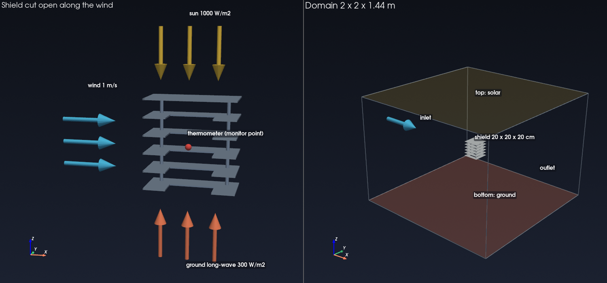
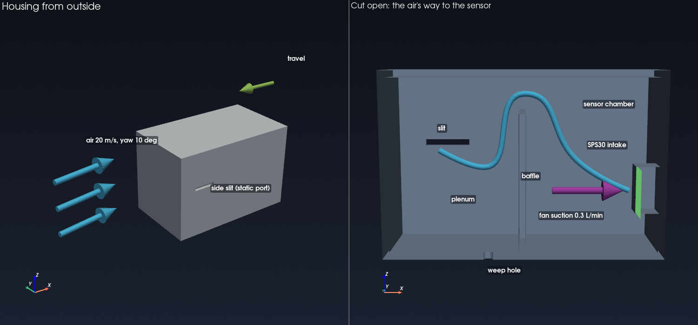

# AeroThermalStudio — Uživatelská příručka

Přehled všech nastavení: co dělají, na co mají vliv a jak volit hodnoty.
Úvod krok za krokem najdete v [TUTORIAL.md](TUTORIAL.md).

> **Poznámka.** Názvy nastavení jsou v programu anglicky, proto je zde uvádím
> anglicky s českým vysvětlením.

**Obsah**

1. [Konvence](#1-konvence)
2. [Geometrie](#2-geometrie)
3. [Výpočetní oblast](#3-výpočetní-oblast)
4. [Letový režim](#4-letový-režim)
5. [Osa závěsu křidélka](#5-osa-závěsu-křidélka)
6. [Síť](#6-síť)
7. [Řešič](#7-řešič)
8. [Výsledky](#8-výsledky)
9. [Mikroklima senzoru](#9-mikroklima-senzoru)
10. [Vizualizace](#10-vizualizace)
11. [Projekty a nastavení](#11-projekty-a-nastavení)
12. [AI asistent](#12-ai-asistent)
13. [Soubory na disku](#13-soubory-na-disku)
14. [Poznámky k fyzice](#14-poznámky-k-fyzice)

---

## 1. Konvence

**Jednotky.** Metry, sekundy, kilogramy, newtony, pascaly, kelviny — kromě
případů, kdy název pole říká jinak (`_deg` pro stupně, `_c` pro stupně
Celsia, `_ms` pro metry za sekundu). Každé pole nese jednotku v názvu nebo
v nápovědě.

**Souřadný systém — osy rakety.** Ať byl CAD nakreslen jakkoli, raketa se
zobrazuje i vyhodnocuje **nastojato, špičkou podél +Z**, tak jak stojí na
rampě a letí. Vámi zvolený referenční bod (obvykle špička) je v (0, 0, 0),
takže těleso leží v záporném Z: křidélko u zádi 1,3 m dlouhé rakety je zhruba
v z = −1,2. V těchto osách je 3D náhled, vykreslené obrázky, složky sil,
působiště i závěsy křidélek.

| Osa rakety | Míří | Síla podél ní |
|---|---|---|
| +Z | Ve směru špičky (nahoru při svislém letu) | Odpor rakety letící špičkou napřed je **záporné** F_z |
| +X | Ve směru klopení | Vztlak od kladného úhlu náběhu je **+F_x** |
| +Y | Doplňuje pravotočivou soustavu | Boční síla od vybočení |

Model, který už má špičku na +Z, si své osy ponechá beze změny.

**Soustava řešiče.** Uvnitř leží síť s tělesem podél **+X** a proudem
přicházejícím podél +X, protože s tím počítá konvence úhlu náběhu v SU2. Obě
soustavy se liší pevnou rotací (x_raketa = z_řešič, y_raketa = y_řešič,
z_raketa = −x_řešič), takže kvůli zobrazení nastojato se nic nepřesíťovává.
Čísla v soustavě řešiče jsou dál v `result.json` a v odpovědích MCP,
označená jako taková.

**Úhly.** Úhel náběhu a vybočení aplikuje *řešič* nakloněním přicházejícího
proudu. Síť se vždy tvoří v soustavě tělesa. Proto změna úhlu nevyžaduje nové
síťování.

**Kontrola vstupů.** Každý vstup má meze. Hodnota mimo rozsah je odmítnuta
s vysvětlením, ne tiše oříznuta — stejně v grafickém rozhraní i přes MCP.

---

## 2. Geometrie

### STEP file

Cesta k souboru `.step` nebo `.stp`. Přetáhněte do okna, nebo vyberte přes
**Browse**.

Soubor musí obsahovat **objemové těleso** (*solid*), ne sadu ploch. Pokud
import hlásí, že žádné těleso nenašel, sešijte plochy do tělesa ve svém CAD
programu.

Při importu se geometrie ozdravuje: rozdělené plochy se sešijí, degenerované
hrany odstraní, drobné plošky opraví. Pokud ozdravení těleso zničí — což se
u některých jednoduchých tvarů stává — použije se neozdravený import a zpráva
to uvede.

### Air comes from

Směr, kterým **míří špička** ve vašem CAD souboru. Raketa nakreslená
nastojato, špičkou nahoru v modelu s osou Y nahoru, je **`+Y`**.

| Volba | Kdy |
|---|---|
| `+X` … `-Z` | Těleso je zarovnáno s osou CAD |
| Vlastní vektor | Ve všech ostatních případech — směr, kam míří špička |

Ať zvolíte cokoli, model se pak zobrazí špičkou nahoru podél +Z.

> Parametr sítě pod tím, `nose_direction`, je opačný: směr od špičky *k
> zádi*, takže špička na +Y znamená `nose_direction = -Y`. Tlačítka dřív
> ukazovala přímo tuhle hodnotu, takže vedle poznámky „nose at +Y" svítilo
> „−Y". Teď ukazují, kde špička je, a převod se děje skrytě. V MCP a
> v projektových souborech má parametr pořád původní význam.

Vlastní vektor se automaticky normalizuje; záleží jen na směru. Nulový vektor
je odmítnut.

**I tohle se vyplní samo.** Při importu program najde nejdelší osu modelu a
hledá křidélka: konec, který je nese, je záď. Teprve když křidélka nejsou ani
na jednom konci, porovná tloušťku konců, protože špička se zužuje a záď ne.
Křidélka mají přednost, protože samotnou tloušťku může zmást tryska motoru,
která je tenká a sedí úplně na konci zádě. Podle toho se nastaví
přepínače a poznámka pod názvem souboru řekne, co našel — *„nose at +Y"*.

Když jsou oba konce stejné — hladká trubka, těleso se zúženou zádí —
program hádat nebude. Poznámka se zeptá, na kterém konci je špička, a
asistent se zeptá na totéž místo toho, aby si jeden konec vybral.

Toto je nastavení s největšími důsledky. Když je špatně, těleso se vysíťuje
bokem nebo pozpátku a všechny výsledky budou věrohodné a chybné: raketa
letící pozpátku vyprodukuje kompletní polární křivku odporu.

### Raketa nebo křidélko, a kolem čeho se naklápí

**Model is a** — *Rocket* nebo *Fin / wing*, nastaví se podle tvaru při
otevření souboru: těleso, jehož nejdelší strana je víc než 3,5krát delší než
každá z ostatních dvou, je raketa; tenká deska je křidélko. Raketa dál dostává
automatické přemapování os, špičkou nahoru podél +Z. Křidélko se vztahuje ke
své **hloubce** (délka) a **půdorysné ploše** (hloubka × rozpětí), ne k průřezu
trupu, a nemá špičku: kterou hranou míří proti vzduchu, nastavíte v **Air
comes from**.

**Tilt about** — osa v CAD, kolem které se model naklápí při změně úhlu
náběhu: rozpětí nebo osa závěsu křidélka. Stane se osou, kolem které řešič
úhel náběhu otáčí proud, takže „naklop křidélko kolem závěsu" znamená přesně
to. *Automatic* naklápí křidélko kolem rozpětí a raketu podle osy špičky. Musí
ležet napříč proudem.

**Vidět na modelu.** 3D náhled obojí kreslí přes naimportovaný model: **modré
šipky** pro přicházející vzduch pod úhlem náběhu a vybočení nastaveným ve
*Flight condition* (posuňte posuvníky a šipky se natočí) a **oranžovou tyč**
modelem pro osu naklápění, s obloukovou šipkou pro smysl kladného úhlu.
Obrázek zkontrolujte před síťováním.

### Reference origin

Bod přesunutý do počátku větrného tunelu. Použijte **špičku**.

Je to referenční bod pro působiště, takže smysluplná volba dělá výsledky přímo
interpretovatelné — „působiště je 0,62 m za špičkou" místo „0,62 m od nějakého
libovolného bodu".

### Scale to metres

Násobek převádějící jednotky CAD na metry.

| Jednotky CAD | Hodnota |
|---|---|
| Metry | `1.0` |
| Milimetry | `0.001` |
| Centimetry | `0.01` |
| Palce | `0.0254` |

**Tohle se vyplní samo.** Při importu STEP souboru se z něj přečte
deklarovaná jednotka a doplní se sem; řádek pod názvem souboru pak říká, co
se našlo — *„Sapphire.step, read as millimetres — 1.32 m across"*. Tu větu si
přečtěte. Když rozměr neodpovídá očekávání, je jednotka špatně a nic dalšího
si toho nevšimne.

Deklaraci program věří jen potud, pokud dává smysl. Některé exportéry,
OpenCASCADE mezi nimi, zapíšou milimetrovou hlavičku do modelu, jehož
souřadnice jsou zjevně v metrech; slepé následování by z metrové rakety
udělalo milimetrovou. Když deklarovaná jednotka a vlastní velikost modelu
nesouhlasí, vyhrává velikost a poznámka to uvede. Když soubor nedeklaruje
nic, poznámka vyzve ke kontrole.

Chybná hodnota škáluje Reynoldsovo číslo stejným poměrem a znehodnotí
všechno. Zkontrolujte referenční délku ve zprávě o síti proti očekávání.

### Jak se podívat na to, co jste naimportoval

Model se objeví ve 3D náhledu hned po načtení, **nastojato, špičkou podél
+Z**, z boku, s trojicí os v rohu. Vysíťuje se hrubě — pár vteřin, žádné
mezní vrstvy, žádné okolí — jen abyste se na něj mohl podívat.

**Podívejte se na něj.** Není to ozdoba: model projde přesně tím zarovnáním,
kterým projde síť, a pak se postaví na záď. Špička patří nahoru. Když je
dole, je špatně směr špičky a všechno, co bude následovat, budou naprosto
věrohodné síly pro raketu letící zádí napřed.

Když náhled vytvořit nejde, log to napíše a import pokračuje: těleso, které se
nedá hrubě vysíťovat, může s ostrým nastavením projít bez problémů.

### Předání souboru asistentovi

Import STEP souboru zároveň řekne vestavěnému asistentovi, o který soubor
jde. Můžete pak napsat *„vysíťuj model, co jsem právě naimportoval, špička
podél +Y, coarse"* a cestu znovu psát nemusíte — asistent použije tentýž
soubor i tutéž jednotku, jakou vidíte ve formuláři. V odpovědi potvrdí, který
soubor použil.

---

## 3. Výpočetní oblast

Objem vzduchu kolem tělesa, rozměřený v násobcích délky tělesa `L`.

| Nastavení | Výchozí | Rozsah | Poznámka |
|---|---|---|---|
| Upstream | 5 L | 1–50 | Špička ke vstupu |
| Downstream | 10 L | 1–50 | Dno k výstupu |
| Radial | 5 L | 1–50 | Osa k vnější hranici |
| Shape | cylinder | cylinder / box | |

**Volba hodnot.** Výchozí nastavení vyhovuje většině vnější aerodynamiky.

- *Příliš malá* oblast a hranice ovlivňuje řešení — klasický příznak je
  výsledek, který se změní po zvětšení oblasti.
- *Příliš velká* a buňky se plýtvají na vzduch, kde se nic neděje.

Downstream je větší, protože úplav potřebuje vzdálenost k rozvinutí. Při
nadzvukových rychlostech lze často zmenšit vzdálenost proti proudu, protože
poruchy se nemohou šířit dopředu před čelní rázovou vlnu. Při transsonických
rychlostech udělejte opak: poruchy se šíří daleko, dejte jim víc prostoru.

**Tvar.** `cylinder` plýtvá kolem štíhlého tělesa méně buňkami. `box` se hodí
pro krabicové případy a situace blízko země, jako je krabička senzoru.

---

## 4. Letový režim

| Nastavení | Rozsah | Poznámka |
|---|---|---|
| Speed as | mach / tas | Jak se interpretuje hodnota rychlosti |
| Speed | Mach 0,05–3,5, nebo m/s | |
| Angle of attack | ±90° | Klopení vůči proudu |
| Sideslip | ±90° | Vybočení vůči proudu |
| Pivot height | m | Osa naklápění nahoru (+) / dolů (−); momenty se berou k ní |
| Altitude | −610 až 32 000 m | Nastaví tlak, teplotu, hustotu |

**Mach, nebo pravá vzdušná rychlost.** Machovo číslo řídí fyziku —
stlačitelnost, rázové vlny, volbu numerického schématu. Pravou vzdušnou
rychlost hlásí palubní počítač. Souvisí spolu přes rychlost zvuku, která
závisí na teplotě a tedy na výšce, takže 200 m/s u hladiny moře a v 10 km dává
různá Machova čísla.

**Za ±20°** se proudění kolem štíhlého tělesa masivně odtrhává a ustálené
RANS řešení je jen orientační. Úhly do ±90° jsou povolené; výsledek to uvede
v poznámce.

**Výška** používá standardní atmosféru ISA-1976, ověřenou proti publikovaným
tabulkám. Alternativně lze zadat tlak a teplotu přímo (v souborech projektu a
přes MCP), když máte naměřené podmínky.

Odvozený stav se zobrazuje živě:

```
M 2.000  |  V 680.6 m/s  |  p 101.3 kPa  |  T 288.2 K
```

---

## 5. Osa závěsu křidélka

| Nastavení | Význam |
|---|---|
| Name | Označení ve výsledcích a křivkách |
| Point | Libovolný bod na ose závěsu, metry, v osách rakety (špička podél +Z) |
| Direction | Osa otáčení, v osách rakety |

Osa závěsu se kreslí do náhledu přes stojící model, takže je vidět, jestli
sedí na křidélku. Projekty uložené dřív, než osy rakety existovaly, mají
závěsy v soustavě řešiče; při otevření se převedou a znamenají přesně tentýž
závěs.

**Jak se moment počítá.** Řešič hlásí aerodynamický moment kolem referenčního
bodu. To není, co cítí servo. Program:

1. Vezme celkovou sílu a moment kolem referenčního bodu;
2. Přenese moment do vašeho bodu závěsu pomocí vztahu pro posun osy
   `M_závěs = M_ref + (r_ref − r_závěs) × F`;
3. Promítne výsledek do vašeho směru závěsu.

Výstupem je skalár v newtonmetrech. Otáčet křidélkem může jen složka podél
osy; zbytek nese ložisko.

**Znaménko.** Kladné podle pravidla pravé ruky kolem zadaného směru. Otočení
směru otočí znaménko. Pro návrh serva je rozhodující velikost.

**Kontrola.** Síla působící přesně skrz osu závěsu dává přesně nulový moment,
bez ohledu na to, kde leží reference řešiče. Toto ověřují testy.

---

## 6. Síť

### Rozlišení (Resolution)

| Předvolba | Buňky, aerodynamika | Buňky, teplo |
|---|---|---|
| coarse | 250 000 – 400 000 | 150 000 – 230 000 |
| medium | 400 000 – 600 000 | 230 000 – 320 000 |
| fine | 600 000 – 750 000 | 320 000 – 400 000 |

Generátor sítě neaplikuje jen předvolenou velikost. Vysíťuje, spočítá buňky a
upraví charakteristickou velikost, dokud se počet netrefí do rozsahu — až
čtyři pokusy. To dělá z rozsahu záruku, ne naději, i na libovolné geometrii.

Rozsahy jsou zvoleny tak, aby výpočet trval 3–8 minut na šestijádrovém stroji
s 16 GB RAM.

### Prism layers

Rozsah 5–8, výchozí 7. Tenké ploché buňky vrstvené u stěny, které rozlišují
mezní vrstvu.

Více vrstev lépe rozliší profil u stěny a stojí buňky. Sedm je dobrý
kompromis pro modelování turbulence se stěnovými funkcemi.

V konkávním koutě — kořen křidélka, zúžená záď navazující na trysku — by
vrstvy od obou stěn narostly do stejného prostoru. Generátor to kontroluje
u každé vrstvy a dotčené uzly zastaví, takže je tam vrstva místně tenčí.
Buňky, které tím přijdou o stranu, se zapíší jako jehlany nebo čtyřstěny,
ne jako zdeformované prizmy, a SU2 by měl hlásit „All volume elements are
correctly oriented“. Pokud generátor okolní sítě vrstvy přesto odmítne,
síť se zkusí znovu s o jednu vrstvu méně, místo aby skončila chybou.

### Target y+

Rozsah 30–300, výchozí 45.

y⁺ je bezrozměrná vzdálenost od stěny. Říká, kde leží střed první buňky
v rámci mezní vrstvy:

| y⁺ | Oblast | Vhodné pro |
|---|---|---|
| < 5 | Viskózní podvrstva | Modely rozlišující stěnu, velmi drahé |
| 30–300 | Logaritmická vrstva | **Stěnové funkce** — co používá tento program |
| mezi | Přechodová vrstva | Vyhnout se; ani jeden přístup neplatí |

Držte se 30–60, pokud nevíte, proč chcete jinak. Generátor sítě spočítá
potřebnou výšku první vrstvy z letového režimu, takže zadáváte fyzikální cíl a
on dopočítá geometrii.

Dosažené y⁺ se po vysíťování vypíše a mělo by přesně odpovídat zadání.

### Minimum quality

Hlásí se po vysíťování: nejhorší buňka jako podíl dokonale tvarované.

| Hodnota | Hodnocení |
|---|---|
| > 0,3 | Zdravé |
| 0,1 – 0,3 | Přijatelné |
| < 0,05 | Očekávejte potíže s konvergencí |

Minimum určuje jediná nejhorší prizma a ta je skoro vždy v konkávním koutě —
tryska navazující na plochou základnu, kořen křidélka — kde se vrstvy
stlačí bez ohledu na zbytek sítě. Čtěte ho spolu s **počtem špatných prizem**
(kvalita pod 0,3): hrstka z několika set tisíc je lokální kout, ne špatná
síť, a není důvod síť zahodit.

Dál od stěny rostou čtyřstěny úměrně vzdálenosti od tělesa, rychlostí danou
rozlišením (coarse nejrychleji, fine nejpomaleji). Bez toho byly buňky
kousek před špičkou 75mm rakety větší než raketa sama a žádná rázová vlna
na nich nemohla přežít.

---

## 7. Řešič

| Nastavení | Výchozí | Poznámka |
|---|---|---|
| Turbulence model | SST | SST k-ω, nebo SA (Spalart–Allmaras) |
| Scheme | Auto | Nestlačitelně pod Mach 0,3, JST do 0,8, Roe nad; nebo zvolte JST, ROE, AUSM, HLLC (vždy stlačitelně) |
| CFL start | Auto | 5,0 pod Mach 0,6, 2,0 do Mach 1,2, 1,0 nad. Číslo, které zadáte, se použije přesně tak |
| CFL growth | Auto | Kolikrát adaptivní CFL vzroste za iteraci: 1,15 / 1,10 / 1,05 podle režimu |
| CFL max | Auto | Kde adaptivní CFL skončí: 100 / 50 / 25 podle režimu |
| Max iterations | 5000 | Tvrdý strop |
| Convergence residual | −5,0 | Pokles log₁₀ RMS rezidua hustoty od maxima, v řádech. Relativně, protože při Mach 0,1 reziduum *začíná* kolem −5 a absolutní práh ukončoval výpočty po 15 iteracích |
| MPI ranks | 10 | O dvě méně než vláken |
| Rescue on divergence | zapnuto | Rozpadlý výpočet zopakovat v prvním řádu a pak restartovat ve druhém |
| Stall timeout | 300 s | Vzdát to, když řešič takto dlouho mlčí |
| Wall-time limit | 7200 s | Vzdát to po této celkové době |

**Start je jen start.** Adaptivní CFL od počáteční hodnoty každou iteraci
roste. Podzvukové výpočty ho dřív zdvojnásobovaly, takže se CFL 5 dostalo na
100 za pět iterací a případ Mach 0,7 se rozpadl na každé síti; zadat nízké CFL
nepomohlo, protože ho rampa hned vyhnala zpátky. Pro opatrný výpočet snižte
**CFL max** a **CFL growth** nechte kolem 1,05. Od Mach 0,6 se výpočet také
startuje stejně opatrně jako transonický: u rakety s křidélky dosahuje proud
přes rameno špičky a náběžné hrany křidélek lokálně rychlosti zvuku už kolem
Mach 0,7.

### Když se výpočet rozpadne

Křehký případ je studený nadzvukový start. První iterace rekonstruují přes
ráz, který ještě neexistuje, na síti dimenzované na zkonvergované řešení —
a pokud zároveň rychle stoupá CFL číslo, výpočet může dojít k zápornému
tlaku a během několika iterací skončit hláškou
`SU2 has diverged (NaN detected)`.

Nově se automaticky stane dvojí:

- **Rozpad se zachytí okamžitě.** Běh skončí na iteraci, která přestala být
  konečná, místo aby dojel až na strop iterací.
- **Výpočet se zopakuje.** Proběhne znovu jako **Roe prvního řádu** s nízkým
  CFL (0,5, roste 1,05× za iteraci nejvýš na 10), aby proudění dostalo zhruba
  správný tvar, a z tohoto řešení se restartuje ve druhém řádu v původně
  zvoleném schématu. Výsledek je označen jako **rescued** a nese poznámku, že k
  tomu došlo. Čísla platí, ale případ potřeboval pomoc — a to obvykle
  znamená, že síť je na daný režim hrubší, než by měla být. Pokud se to
  stává často, zjemněte síť, místo abyste spoléhali na záchranu.

Když se rozpadne i záchranný běh, chyba uvede oba pokusy i jejich nastavení.
Schéma prvního řádu při takovém CFL málokdy selže jen kvůli numerice, takže
se nejdřív podívejte na kvalitu sítě — minimum pod zhruba 0,2 je podezřelé —
a pak zkuste menší CFL max.

### Výpočet, který se nikdy nevrátí

Běh řešiče má nově dva časové limity, oba nastavitelné výše. **Stall**
zachytává ten nejhorší případ: zhavarovaná MPI úloha může nechat naživu
proces, který drží výstupní rouru, a program na toto čtení dřív čekal
donekonečna — žádný výstup, žádný počítající řešič, žádný konec. Ať se
dosáhne kteréhokoli limitu, ukončí se celý strom procesů a běh selže
s vysvětlením, místo aby tiše seděl. Výpočet spuštěný asistentem jde navíc
ukončit jeho tlačítkem **Stop**.

### Volba schématu

Vybírá se automaticky podle Machova čísla:

- **Pod Mach 0,3** — **nestlačitelný** řešič SU2 (konstantní hustota, tok
  FDS, MUSCL druhého řádu). Numerická disipace stlačitelného řešiče roste
  s rychlostí zvuku, ne s rychlostí proudění, takže při nízkém Machu přehluší
  fyziku: na Sapphire při Mach 0,1 dal stlačitelný JST C_d 2,2, nestlačitelný
  výsledek je kolem 1,3. Pod Mach 0,3 se hustota mění o méně než 5 %, takže
  se nic skutečného neztratí.
- **Mach 0,3 až 0,8** — centrální diference JST se skalární disipací. Účinné
  v hladkém podzvukovém proudění.
- **Od Mach 0,8 výše** — protiproudé schéma Roe s rekonstrukcí MUSCL druhého
  řádu a Venkatakrishnanovým limiterem, plus entropická korekce. Limiter je
  to, co brání oscilacím na rázových vlnách; entropická korekce brání
  Roeovu řešiči připustit nefyzikální expanzní rázy.

Přepisujte jen, když víte proč.

### Konvergence

Výpočet se zastaví, když **buď**:

- reziduum hustoty dosáhne prahu, **nebo**
- součinitel odporu je ustálený po zadaný počet posledních iterací.

Druhé je v praxi důležité: RANS výpočet často dosáhne použitelných sil dávno
před cílovým reziduem, a právě o síly vám jde.

Živý konvergenční graf se objeví se začátkem výpočtu a po skončení iterací
zmizí, tady i v záložce AI Assistant.

### MPI ranks

Na kolik procesů se řešič rozdělí. Použijte o dvě méně, než máte logických
procesorů, aby rozhraní zůstalo svižné — na 12vláknovém CPU tedy 10.

Více procesů než fyzických jader má klesající přínos; každý proces navíc
potřebuje paměť a příliš mnoho jich na velké síti vyčerpá 16 GB.

---

## 8. Výsledky

| Veličina | Značka | Význam |
|---|---|---|
| Součinitel odporu | C_d | Odpor / (q·S) |
| Součinitel vztlaku | C_l | Vztlak / (q·S) |
| Součinitel boční síly | C_s | Boční síla / (q·S) |
| Klopivý moment | C_m | Moment / (q·S·L) |
| Síly | F_x, F_y, F_z | Složky podél **os rakety**, newtony: F_z ve směru špičky |
| Odpor / vztlak / boční síla | | V soustavě proudu, newtony |
| Působiště | | Poloha na ose Z rakety, metry (záporná: za počátkem) |
| Moment na závěsu | τ | Newtonmetry na každém závěsu |

Zde `q = ½ρV²` je dynamický tlak, `S` referenční plocha (průřez tělesa, není-li
přepsána) a `L` referenční délka (průměr tělesa, není-li přepsána).

**Síla v každé ose rakety** je druhá řada karet — *Force along rocket
X / Y / Z*. U rakety letící přímo vzhůru při nulovém úhlu náběhu je F_z
odpor se znaménkem minus (tlačí raketu zpět k zádi) a F_x, F_y jsou jen
numerický šum. S úhlem náběhu roste F_x: to je normálová síla, která raketu
natáčí.

**Soustava tělesa versus soustava proudu.** Soustava tělesa je pevně spojená
s raketou. Soustava proudu je zarovnaná s prouděním. Při nulovém úhlu náběhu
splývají; při úhlu se liší přesně o něj. Odpor a vztlak jsou z definice
veličiny v soustavě proudu.

**Působiště** hlásí `NaN` při nulovém úhlu náběhu i vybočení a vždy, když je příčná síla pod 5 % osové — to je numerický šum a dělení šumu momentu šumem síly jednou umístilo působiště 5,9 m před špičku. Obecně je `NaN`, když není příčná síla — při nulovém náběhu na
symetrickém tělese působiště skutečně není definováno a uvést číslo by svádělo
věřit něčemu bezvýznamnému. Spusťte při 2–5°, abyste dostali použitelnou
hodnotu.

---

## 9. Mikroklima senzoru

### Prostředí

| Nastavení | Výchozí | Rozsah | Poznámka |
|---|---|---|---|
| Vehicle speed | 2,0 m/s | 0–50 | Žene náporový vzduch nasáváním |
| Ambient air | 25 °C | −50 až 70 | Skutečná teplota vzduchu — reference |
| Solar flux | 800 W/m² | 0–1400 | ~1000 je jasné poledne; 0 je noc |
| Height above roof | 0,1 m | 0,01–2 | Porovnává se s tepelnou vrstvou střechy |

### Vlastnosti povrchů

| Nastavení | Výchozí | Poznámka |
|---|---|---|
| Housing solar absorptivity | 0,30 | Podíl pohlceného slunce. Bílá ~0,1, černá ~0,95 |
| Roof solar absorptivity | 0,65 | Lakovaný plech. Holý hliník ~0,2 |
| Housing emissivity | 0,90 | Dlouhovlnné vyzařování. Většina nekovů 0,85–0,95 |
| Housing conductivity | 0,18 W/(m·K) | PLA/PETG. Hliník ~200 |
| Sensor position | — | Poloha čipu BMP580 uvnitř krabičky |

Pohltivost a emisivita jsou různé vlastnosti na různých vlnových délkách. Bílý
nátěr může mít pohltivost 0,2 ve slunečním světle a emisivitu 0,9
v infračervené oblasti — právě proto bílý nátěr zůstává chladný.

### Výstupy

| Údaj | Význam |
|---|---|
| Sensor reads | Co by BMP580 naměřil |
| True ambient | Skutečná teplota vzduchu |
| **Measurement error** | Rozdíl — číslo, o které jde |
| Roof surface | Jak se rozpálí střecha |
| Housing | Teplota krabičky |
| Intake flow | Hmotnostní průtok nasávání, mg/s |
| Roof thermal layer | Tloušťka ohřáté vrstvy vzduchu u střechy, mm |

Chyba je barevně odlišená: zelená pod 0,5 K, oranžová pod 2 K, červená nad.

**Číslo tepelné vrstvy je to důležité.** Je-li vaše výška nasávání pod ním,
odebíráte vzduch, který střecha ohřála, a žádný návrh krabičky to nespraví.
Panel říká, ve kterém režimu jste.

### Dvě úrovně přesnosti

**Analytická** (okamžitá, výchozí v rozhraní). Řeší provázané energetické
bilance střechy, krabičky, průtoku trubičkou a komory. Dost rychlá na
aktualizaci při tahání posuvníkem, což z ní dělá návrhový nástroj, ne dávkovou
úlohu.

**Sdružené CFD** (minuty, potřebuje tepelnou síť). Plné 3D řešení s vedením
tepla pevnou krabičkou a prouděním vnitřního vzduchu. Rozliší detaily, které
analytický model průměruje.

Analytický model zároveň připravuje linearizaci záření pro CFD výpočet, takže
spolu spolupracují, nejsou to alternativy.


### Studie radiačního štítu

> Podrobný návod pro začátečníky krok za krokem, včetně Ansys Student, je
> v **[Studii radiačního štítu](SHIELD_STUDY_GUIDE.md)**.

Druhá podzáložka, **Radiation shield study**, řeší stejnou otázku pro přirozeně
větraný radiační štít (lamelové stínítko kolem teploměru): o kolik se vzduch u
teploměru liší od skutečné teploty vzduchu a jak špatné to může být? Drží se
referenční metodiky (Atmosphere 2026, 17(3), 272) a rozšiřuje ji o střechu
vozidla.

**Nastavení.** Štít ze STEP souboru, nebo vestavěný vícedeskový štít
20 × 20 × 20 cm, uprostřed vzduchové domény 2000 × 2000 × 1440 mm (obojí lze
měnit); bod teploměru vůči středu štítu; teplota vzduchu na vstupu a výchozí
podmínka — vítr, sluneční záření shora (1000 W/m²) a spodek: **země**
vyzařující dlouhovlnný tok (300 W/m²), nebo **střecha vozidla** s pevnou
teplotou (343 K = 70 °C, která navíc ohřívá vzduch proudící nad ní). Vlastnosti
povrchů: sluneční pohltivost a emisivita štítu, emisivita střechy, dlouhovlnné
záření oblohy (auto: Swinbank), albedo země.

**Nejisté vstupy.** Rychlost větru (0,5–5 m/s), sluneční záření shora
(800–1200 W/m²) a záření zdola (300–800 W/m²; v režimu střechy určuje její
teplotu přes q = ε σ T⁴), každý s rozdělením (rovnoměrné, normální,
trojúhelníkové) a škálou (vítr se rozkládá logaritmicky).

**Postup.**

1. *Design of experiments* — face-centred central composite (15 bodů, jako
   DesignXplorer), nebo Latin hypercube.
2. *Spočtení design pointů* — **Run analytic study** je spočte okamžitým
   zjednodušeným modelem; **Prepare CFD cases + Fluent package** vytvoří síť
   domény, spočte paprsky pro radiaci a zapíše SU2 případy a balíček pro ANSYS
   Fluent/Workbench; **Solve CFD design points** je spočte v SU2 zde (jeden
   výpočet na bod, minuty až hodina; *Points to solve now* omezí jejich počet,
   např. 1 = jen středový bod pro porovnání sítí), nebo se na výpočetním počítači spustí
   `run_design_points.bat`; **Import solved design points** načte CSV spočtené
   jinde (např. tabulku design pointů z Workbenche).
3. *Response surface* — úplný kvadratický polynom nebo interpolace radiálními
   bázemi; zobrazuje se chyba leave-one-out, protože to je poctivé číslo
   přesnosti.
4. *Monte Carlo* — 10 000 (až 2 000 000) náhodných podmínek na ploše: průměr,
   rozptyl, **nejhorší případ i s jeho vstupy**, **spolehlivost**
   (P(|dT| ≤ tolerance)) a citlivost na každý vstup. U analytického modelu se
   nejhorší případ navíc přepočte přímo.

**Radiace v SU2.** SU2 nemá radiaci povrch–povrch, takže ji program počítá
vrháním paprsků po povrchu štítu — kam dopadá slunce, kolik oblohy a země
ploška vidí — a pohlcené mínus vyzářené záření zadá na stěnách; vyzařování je
linearizované kolem teploty stěny, takže ho SU2 řeší implicitně (druhý průchod
ho přelinearizuje). SU2 nemá
standardní k-ε; jeho případy používají SST. Balíček pro Fluent se drží zadání
(standardní k-ε, DO radiace, pevná zóna štítu).

**Sweep a obrázek.** *Sweep one input* projde jeden vstup od *From* do *To*
po *Step* (např. vítr 0,2–5 m/s po 0,2) s ostatními na výchozích hodnotách a
každý bod spočítá přímo analytickým modelem; záložka **Sweep** pod grafy
ukáže graf a všechny řádky, uložené i jako `sweep.csv` ve složce `sweeps`.
**Draw 3D geometry** (spustí se i samo s první studií) ukáže na záložce
**3D geometry** štít v řezu s teploměrem, sluncem, zářením zespodu a větrem,
a štít ve výpočetní doméně.




### Studie krytu SPS30

Třetí podzáložka, **SPS30 housing study**, prověřuje kryt prachového senzoru
SPS30 na pohybující se platformě: zapuštěné statické štěrbiny po obou
stranách (statický tlak, ne náporový), plenum, které vzduch zpomalí, a
přepážku, kolem které vzduch zatočí, ale kapky vody ne. Tři cíle: vzduch u
čela senzoru pomalejší než 1 m/s, žádná kapka na čele a dostatečná výměna
vzduchu v komoře senzoru.

**Nastavení.** STEP krytu (nebo vestavěný kryt 120 × 70 × 80 mm), směr, kam
platforma v CAD jede (*Travel direction*), čelo senzoru (*střed*, kam *hledí*
a *velikost*), rovina, na které se měří výměna vzduchu, ventilátor SPS30
(modelovaný jako malé odsávání na čele; průtok je odhad — nastavte ho podle
měření), velikost tunelu v délkách krytu, cíle a rozměry pro zjednodušený
model.

**Vstupy.** Rychlost platformy (5–35 m/s), stočení/yaw (−20..20°, boční vítr)
a průměr kapek (10–2000 µm, logaritmicky), každý s rozdělením.

**Sweep a obrázek.** Stejně jako u štítu: *Sweep one input* (rychlost, yaw
nebo velikost kapek po pevných krocích, počítáno přímo) a **Draw 3D
geometry** — kryt zvenku a v řezu se štěrbinami, plenem, přepážkou, komorou
senzoru, sáním SPS30 s ventilátorem a odvodňovacím otvorem.



**Postup** — jako u studie radiačního štítu: **Run analytic study**
(zjednodušený model, okamžitě), **Prepare CFD cases + Fluent package**,
**Solve CFD design points (SU2 + droplets)** (*Points to solve now* omezí
počet), nebo **Import solved design points (CSV)** z Fluentu. Výsledky:
nejhorší rychlost u čela, nejhorší průnik kapek, nejmenší výměna vzduchu a
spolehlivost (všechny cíle splněny), podíl pro každý cíl, nejhorší
nevyhovující podmínka, histogram každého výstupu a tabulka design pointů.

**Kapky v SU2.** SU2 nemá model diskrétní fáze; vzduch se spočte s SST k-ω a
program v něm kapky sleduje sám (odpor, gravitace, náhodná procházka) a
každou zastaví na stěně, na kterou narazí. Průnik (penetration) je podíl
kapek, které se dostaly do krytu a doletěly na čelo.

> **Co čekat od fyziky.** Setrvačná separace funguje, když je Stokesovo
> číslo kapky u přepážky kolem ~0,6 nebo víc. Jemná mlha (10–20 µm) v
> pomalém vzduchu uvnitř má Stokesovo číslo mnohem menší a vzduch poslušně
> následuje — to žádná ostřejší zatáčka nespraví; pomůže hydrofobní
> membrána nebo filtr.

Podrobný návod pro začátečníky krok za krokem, včetně Ansys Student s
modelem diskrétní fáze (DPM), je ve **[Studii krytu SPS30](SPS30_STUDY_GUIDE.md)**.

---

## 10. Vizualizace

### Režimy

| Režim | Ukazuje |
|---|---|
| `surface_pressure` | C_p nebo absolutní tlak na tělese |
| `mach_slice` | Machovo číslo v rovině řezu, s izočarami |
| `schlieren` | Gradient hustoty v rovině řezu, jako schlieren snímek z aerodynamického tunelu |

**Proč schlieren pro rázy.** Štíhlá ogivální špička při Mach 1,3 vytvoří
slabý šikmý ráz: Machovo číslo přes něj klesne o pár setin, což barevná škála
roztažená od stagnačního bodu po volný proud skoro neukáže. Gradient hustoty
přes jakýkoli ráz vyskočí o řády, takže Machův kužel od špičky i od křidélek
je jasně vidět. Rozsah barev Machova řezu se bere z obrázku samotného
(2.–98. percentil podle plochy), ne z extrémů, a izočáry se zhušťují tam, kde
je ráz.
| `streamlines` | Proudnice barvené rychlostí nebo teplotou |
| `thermal` | Teplotní pole s vyznačeným senzorem |

### Barevné mapy

`turbo`, `coolwarm`, `viridis`, `jet`, `plasma`, `inferno`.

Pro teplotu použijte **coolwarm** — je divergentní, takže se přirozeně čte
kolem střední hodnoty. Pro cokoli, co bude tištěno v odstínech šedi nebo
prohlíženo barvoslepým čtenářem, použijte **viridis**; je percepčně
rovnoměrná. **turbo** dává největší vizuální kontrast pro tlak a Machovo
číslo.

### Pohledy kamery

`isometric`, `front`, `back`, `side`, `top`, `bottom`, `nose_quarter`,
`tail_quarter`.

Výsledky rakety se kreslí **špičkou nahoru podél +Z**. `front` se dívá na
špičku zepředu, `side` přímo na rovinu klopení — tu, ve které leží výchozí
Machův řez, takže to je pohled pro obrázek rázové vlny.

Machův řez se ořízne na raketu a tři čtvrtiny délky tělesa kolem ní. Okolí
domény je pět až deset délek daleko a řez přes celé by ukázal raketu jako
tečku.

### Záložka Graphics

Každý obrázek skončí v záložce **Graphics**, ať ho nakreslil kdokoli: záložka
sama, asistent, nebo externí MCP klient se stejnou datovou složkou. Obrázky
jsou seřazené od nejnovějšího, s náhledy, a vybraný se ukáže zvětšený.

| Tlačítko | Co dělá |
|---|---|
| **Export …** | Uloží kopii kamkoli, jako PNG (beze změny) nebo JPEG |
| **Export all from this run …** | Zkopíruje všechny obrázky daného výpočtu do složky |
| **Copy** | Vloží obrázek do schránky, např. do zprávy |
| **Open** | Otevře ho v systémovém prohlížeči (také dvojklikem) |
| **Show folder** | Otevře složku, kde je obrázek uložen |
| **Delete** | Smaže vybrané obrázky z disku (nejdřív se zeptá; simulace zůstane). Ctrl/Shift-klik nebo Ctrl+A vybere víc — Export i Delete pak platí pro všechny; funguje i klávesa Delete |

Řádek nahoře kreslí nový obrázek: vyberte dokončený výpočet, typ obrázku,
pohled, barvy a velikost a klikněte na **Render**. Když výpočet doběhne
v záložce Aerodynamics, Machův řez z boku a tlak na povrchu se nakreslí
automaticky.

Obrázky, které vykreslí asistent, se objeví i přímo v jeho konverzaci,
s odkazem rovnou do záložky Graphics. Kliknutím na obrázek (nebo na
**Enlarge**) se otevře v plné velikosti ve vlastním okně: kolečko myši nebo
+/− přibližuje, tažení posouvá, 0 přizpůsobí oknu, 1 je skutečná velikost,
dvojklik přepíná; je tam i **Save as…** a **Open externally**. Totéž nabídne
pravé tlačítko na obrázku. Záložka Graphics nově ukazuje i náhledy geometrie
a grafy sweepů, takže „Open in the Graphics tab“ obrázek vždy najde.

Samotné soubory jsou v `runs/<sim_id>/renders/` v datové složce.

### Rozlišení

`preview` (960×540), `hd` (1920×1080), `2k` (2560×1440), `4k` (3840×2160).

Při zkoumání používejte `preview`, pro obrázky do zprávy `4k`.

### Export

`.vtk` / `.vtu` pro analýzu v ParaView, `.gltf` pro interaktivní 3D scénu,
která se otevře v prohlížeči.

---

## 11. Projekty a nastavení

### Projekty (`.atsproj`)

Projekt ukládá kompletní nastavení: geometrii a natočení, oblast, nastavení
sítě, letový režim, nastavení řešiče, osy závěsů, scénář senzoru, definici
parametrické studie, poznámky a naposledy použitou síť.

Prostý JSON — čitelný, porovnatelný a vhodný k uložení do verzovacího systému
vedle vašeho CAD.

| Akce | Zkratka |
|---|---|
| Nový | Ctrl+N |
| Otevřít | Ctrl+O |
| Uložit | Ctrl+S |
| Uložit jako | Ctrl+Shift+S |

Projekt odkazující na síť, která byla mezitím smazána, to při načtení oznámí a
zakáže spuštění, místo aby selhal později uvnitř řešiče.

Projekt zapsaný novější verzí programu je **odmítnut**, ne částečně načten.
Tiché zahození polí, kterým starší sestavení nerozumí, by ztratilo nastavení
bez upozornění.

### Předvolby

**Settings → Preferences:**

| Nastavení | Efekt |
|---|---|
| Default MPI ranks | Výchozí hodnota pro nové výpočty |
| Default colormap | Předvolená ve výřezu a při vykreslování |
| Render resolution | Předvolené pro ukládané obrázky |
| Mesh resolution | Výchozí předvolba pro nové projekty |
| Ask before discarding | Potvrdit, než Nový/Otevřít zahodí neuloženou práci |
| Autosave before solve | Uložit projekt při spuštění výpočtu |
| Live sensor preview | Přepočítat při pohybu posuvníků |
| Warn about environment | Upozornit při startu na chybějící SU2 nebo MPI |

Poškozený soubor nastavení se nahradí výchozími hodnotami, místo aby zabránil
spuštění.

---

## 12. AI asistent

Záložka **AI Assistant** umožňuje napsat běžnou větou, co chcete, a nechat to
program udělat. Asistent sahá na program přesně přes těch šestnáct nástrojů,
které vystavuje MCP server — umí tedy to, co umíte vy přes rozhraní, a nic
víc.

Běží na modelu podle vaší volby přes [OpenRouter](https://openrouter.ai),
takže potřebujete účet na OpenRouteru a API klíč. Samotný program žádný model
neobsahuje a dokud klíč nezadáte, nikam nic neposílá.

### Zadání API klíče

1. Klíč získáte na [openrouter.ai/keys](https://openrouter.ai/keys).
2. Vložte ho do pole **Key** vlevo v záložce AI Assistant a stiskněte
   **Save key**.

Políčko se hned po uložení vymaže a klíč se už nikdy nezobrazí — jen jeho
maskovaná podoba, například `sk-or-...a1b2`, a informace, kde je uložený.

Kde je uložený, závisí na počítači:

| Úložiště | Kdy se použije | Bezpečné |
|---|---|---|
| Proměnná prostředí `OPENROUTER_API_KEY` | Má vždy přednost, pokud je nastavená | Ano — na disk se nic nezapisuje |
| Správce pověření Windows | Kdykoli je nainstalovaný balík `keyring` | Ano — chráněný vaším přihlášením |
| `credentials.json` | Jen když žádné úložiště pověření není | **Ne** — prostý text, práva jen pro vlastníka |

Poslední případ program oznámí dialogem, který to říká na rovinu. Je to
náhradní řešení, ne bezpečnostní opatření: klíč chrání před ostatními účty na
stroji a před ničím dalším. `Setup.bat` balík `keyring` nainstaluje, aby se
použil Správce pověření.

**Klíč se nikdy nedostane do souboru projektu ani do `settings.json`.** To
jsou prosté JSONy určené k verzování; klíč v nich by skončil v repozitáři.
Tlačítko **Remove** klíč smaže ze všech úložišť naráz.

### Volba modelu

Rozbalovací seznam **Model** obsahuje výběr: `deepseek/deepseek-v4.1-flash`,
`meta/muse-spark-1.3-contributor`, `qwen/qwen3.7-flash`,
`openai/gpt-6-luna` a `deepseek/deepseek-chat`. První položka,
**Custom…**, otevře pod seznamem políčko, do kterého napíšete libovolné id.
**Fetch available models** přidá pod výběr živý katalog, na který váš účet
skutečně dosáhne, a nabízí ho i jako našeptávač při psaní vlastního id —
stojí to za to, protože katalog OpenRouteru se mění každý týden a id, které
v něm není, se odmítne hned při prvním požadavku.

Model musí umět volání nástrojů (tool calling), jinak si s vámi umí jen
povídat. Volba se pamatuje mezi spuštěními.

**Za to, co asistent spotřebuje, platíte OpenRouteru** podle tokenů a sazby
daného modelu. Krátký dotaz stojí zlomek centu, delší série volání nástrojů
víc.

### Nejdřív vám ukáže nastavení

Než asistent vysíťuje nebo spočítá nastavení, které jste ještě neviděl —
nový soubor, jiný směr špičky, typ tělesa nebo osu naklápění, nový úhel
náběhu či vybočení — nakreslí do chatu rychlý obrázek modelu v nízkém
rozlišení (z boku a šikmo) s přicházejícím vzduchem jako modrými šipkami a
osou naklápění jako oranžovou tyčí s obloukovou šipkou. Popisek říká, na
kterém konci CAD modelu je podle něj špička (u křidélka náběžná hrana). Pak
se zeptá, jestli je to tak, jak chcete, a **počká**: dokud neodpovíte, nic se
nesíťuje ani nepočítá. Napište „ano“ a pokračuje, nebo napište, co je špatně
(„špička je na druhém konci“, „naklápět kolem Z“), a nakreslí opravené
nastavení znovu.

Hlídá to program, ne jen model: nástroje pro síť a výpočet nastavení, které
nebylo ukázáno a odsouhlaseno, odmítnou.

### Jak navázat na starší konverzaci

Každá konverzace se uloží na tento počítač, když asistent odpoví, a znovu při
zavření programu. Seznam **Conversation** nad chatem je obsahuje od
nejnovější. Vyberte jednu a vrátí se přepis, asistent si pamatuje vše, co
padlo, i všechny výsledky nástrojů — takže „spusť tutéž síť při Mach 0,9"
funguje — a poznámka vypíše sítě, simulace a projekty, které konverzace
vytvořila. Kliknutím je otevřete: simulace vrátí své výsledky do záložky
Aerodynamics a její síť se stane aktuální, projekt se otevře jako projekt.
**Delete** smaže vybranou uloženou konverzaci. Konverzace jsou ve složce
`ai_chats` v datové složce; nikdy neobsahují API klíč.

### Čas a průběh výpočtu

Řádek pod chatem říká, co se děje a jak dlouho, dvakrát: jak dlouho běží
aktuální krok a jak dlouho celý požadavek — *„Running
run_aerodynamic_simulation — step 2:41 · total 4:05"*. Záložka Aerodynamics
dělá totéž vedle ukazatele průběhu.

Když běží výpočet, ať ho spustil kdokoli, živý graf konvergence ukazuje
reziduum hustoty a součinitele sil a pod ním řádek s iterací, rychlostí
v iteracích za sekundu a tím, jestli reziduum klesá (*converging*), stojí
(*stalled*) nebo roste (*diverging*).

Výsledky, které asistent podá jako tabulku, se vykreslí jako tabulka.

### Kolik to právě stojí

Během běhu požadavku ukazuje řádek pod přepisem, co zatím spotřeboval:

```
4,812 tokens · 61.3 tok/s · $0.0038 · 14s
```

- **tokens** — vstupní a výstupní dohromady, za tenhle požadavek
- **tok/s** — rychlost generování, měřená proti času stráveném čekáním na
  model, ne proti celkovému času. Požadavek, který čtyři minuty síťuje,
  model nezpomalil a tohle číslo to nemá předstírat.
- **$** — vlastní údaj OpenRouteru za daný požadavek, ne odhad z ceníku.
  Někteří poskytovatelé cenu nehlásí; pole pak zůstane prázdné, místo aby
  ukázalo nulu, které byste mohl věřit.
- **sekundy** — reálný čas, který běží i mezi koly, takže poznáte pomalý
  požadavek od zaseknutého.

Údaje se aktualizují po každém kole konverzace, takže drahý požadavek je
vidět ještě ve chvíli, kdy jde zastavit. **New conversation** měřič
vynuluje.

### Jak sledovat, co dělá

Asistent píše do přepisu, co právě dělá, **průběžně** — ne až když skončí:

```
— round 1 —
Než začnu síťovat, zkontroluju nástroje.
▸ get_active_geometry()
  ok — 0.0 s
▸ set_geometry_and_mesh(mesh_resolution=coarse, sizing_mach=1.3)
  ok — 101.6 s
— round 2 —
```

Jsou tam čtyři věci, které dřív nebyly. **Značky kol** ukazují, kolikrát už
model prošel smyčkou. *Kurzívou* je vlastní komentář modelu k tomu, co se
chystá udělat — vždycky se posílal a vždycky se zahazoval. Každé **volání
nástroje** se objeví i s argumenty ještě než proběhne, takže u čtyřminutového
síťování víte, se kterým souborem a jakým nastavením pracuje. A u každého
**výsledku** je čas, který zabral.

Jednořádkový stav pod přepisem dál ukazuje aktuální krok a měřič vedle něj
průběžnou cenu.

**Přerušené spojení už relaci neukončí.** Když vypadne síť nebo je OpenRouter
chvíli přetížený či omezuje rychlost, požadavek se zopakuje — až třikrát, s
rostoucí pauzou — a každé opakování se zapíše do přepisu, aby to nevypadalo
jako zaseknutí. Odmítnutý klíč nebo prázdný kredit se **neopakuje**: ty se
druhým dotazem nezlepší.

Má to poctivou cenu. Dokončení není z hlediska účtování idempotentní: když
spojení spadne až poté, co model odpověď vygeneroval, zaplatíte ji dvakrát.
Ztráta sedmnáctiminutové relace stojí víc, takže opakování je zapnuté — kdo
by radši neriskoval, nastaví `ai_retry_attempts` na `1` v `settings.json`.

### Jak s ním mluvit

Napište požadavek a stiskněte **Send** nebo Ctrl+Enter. Odpovídá v jazyce, ve
kterém píšete. Užitečné požadavky vypadají takhle:

- *„Vysíťuj C:\models\rocket.step se špičkou podél +X, rozlišení coarse."*
- *„O kolik přestřelí BMP580 při 900 W/m² a rychlosti 3 m/s?"*
- *„Porovnej chybu senzoru pro bílou a černou krabičku."*
- *„Projeď Mach 0,5 až 3 při 5 stupních a řekni mi nejhorší moment na závěsu."*
- *„Zkontroluj prostředí a řekni mi, jestli můžu spustit výpočet."*

Každé volání nástroje se objeví v přepisu, jakmile proběhne, i s argumenty a
dobou trvání. Asistent, který by potichu spustil půlhodinovou studii, by byl
horší než žádný.

**New conversation** zapomene historii. Udělejte to při změně tématu: s každým
požadavkem se posílá celá konverzace, takže dlouhá stojí víc a dává modelu
větší šanci splést si dvě úlohy.

### Kontrola nad tím, co dělá

| Přepínač | Co dělá |
|---|---|
| Ask before meshing, solving or sweeping | Potvrzení před každým dlouhým krokem, s názvem nástroje, argumenty a očekávanou dobou běhu. Standardně zapnuto. |
| Max tool rounds | Strop počtu kol volání nástrojů na jeden požadavek. Zabrání zmatenému modelu utrácet kredit ve smyčce. Výchozí 12. |
| Iteration limit | Výpočty spuštěné asistentem skončí nejpozději tady a výsledek se bere jako konečný, s poznámkou, o kolik řádů kleslo reziduum. Výchozí 1000; asistent ho umí změnit (`solver_max_iterations`). |

Když krok odmítnete, model se to dozví a zeptá se, co byste chtěli místo
toho — nezkusí totéž znovu.

### Co neumí

- **Žádné příkazy shellu, žádný přístup k libovolným souborům, žádné spouštění
  kódu.** Hranicí je seznam nástrojů a ty berou jen validované parametry.
- **Nevymýšlí si čísla.** Má v instrukcích hlásit, co nástroje vrátily, včetně
  toho, že výpočet nezkonvergoval nebo že počet buněk minul cílové pásmo.
  Když na čísle záleží, porovnejte přepis s panelem výsledků.
- **Není to aerodynamik.** Program umí obsluhovat dobře; že máte špatně
  geometrii, vám neřekne. Úsudek zůstává na vás.

Požadavky, které napíšete, a parametry simulace se posílají OpenRouteru a
poskytovateli zvoleného modelu. Výsledky a soubory sítí zůstávají u vás — po
síti jdou jen čísla z výsledků nástrojů.

### Když něco nefunguje

| Hlášení | Co znamená |
|---|---|
| *No OpenRouter API key is set* | Uložte klíč, nebo nastavte `OPENROUTER_API_KEY` |
| *OpenRouter rejected the API key* | Klíč je špatný nebo zneplatněný — ověřte na openrouter.ai/keys |
| *insufficient credit* | Dobijte kredit, nebo zvolte levnější model |
| *rate-limiting this key* | Chvíli počkejte; modely zdarma jsou omezované |
| *could not reach OpenRouter* | Síť, proxy nebo firewall |
| *I stopped after N rounds* | Rozdělte požadavek na menší kroky |

---

## 13. Soubory na disku

Výchozí umístění `%LOCALAPPDATA%\AeroThermalStudio`, lze přepsat proměnnou
prostředí `ATS_DATA_ROOT`.

```
AeroThermalStudio/
├── runs/                      jedna složka na síť, simulaci a studii
│   ├── mesh-RRRRMMDD-HHMMSS-xxxxxx/
│   │   ├── record.json        metadata
│   │   ├── mesh.su2           síť
│   │   ├── mesh_request.json  co bylo zadáno
│   │   └── mesh_result.json   co vyšlo
│   ├── aero-.../
│   │   ├── solver.cfg         konfigurace SU2
│   │   ├── history.csv        průběh konvergence
│   │   ├── forces_breakdown.dat
│   │   ├── flow.vtu           objemové řešení
│   │   ├── result.json        zpracovaný výsledek
│   │   └── renders/           vytvořené obrázky
│   └── sweep-.../
│       ├── point_000/ …       jedna složka na bod
│       └── sweep.json         křivky a extrémy
├── projects/                  uložené soubory .atsproj
├── samples/                   vygenerovaný ukázkový CAD
├── su2/                       binárky řešiče, pokud jsou zde
└── settings.json
```

Objemová řešení jsou velká. Staré složky výpočtů mažte pro uvolnění místa —
program čte registr pokaždé znovu a co je pryč, prostě nevypíše.

---

## 14. Poznámky k fyzice

### Proč na y⁺ tolik záleží

U stěny se rychlost mění extrémně rychle. Rozlišit to přímo vyžaduje buňky tak
tenké, že by realistický model narostl na miliony buněk a hodiny výpočtu.

Stěnové funkce modelují profil u stěny analyticky místo jeho rozlišení, což
dovolí první buňce být mnohem větší — ale jen pokud padne do oblasti
logaritmického zákona, y⁺ mezi 30 a 300. Příliš blízko a předpoklad neplatí;
příliš daleko a logaritmická vrstva není rozlišená.

Proto generátor sítě pracuje pozpátku: zadáte cíl y⁺ a letový režim, on
dopočítá výšku buňky.

### Proč prizmata, ne tetraedry

Buňky mezní vrstvy musí být tenké kolmo ke stěně, ale mohou být podél ní
mnohem větší — poměry stran 1000:1 jsou běžné. Tetraedry to neumí dobře;
protažené tetraedry mají příšerné numerické vlastnosti.

Prizmata ano: trojúhelník protažený ve směru normály stěny. Tento program je
vytahuje vlastním algoritmem postupných vrstev, protože 3D vytahování mezní
vrstvy v Gmsh spolehlivě nefunguje. Podrobnosti jsou v README.

Bez prizmat by y⁺ 45 na metrovém tělese vyžadovalo miliony povrchových
trojúhelníků samotných — zhruba pětinásobek stropu buněk, který drží výpočty
v cílovém čase.

### Proč rázové vlny potřebují jiné numerické schéma

Rázová vlna je nespojitost: tlak, hustota i teplota skokem mění hodnotu na
vzdálenosti několika středních volných drah molekul.

Centrální diference předpokládá hladké řešení. Na nespojitosti vytvoří
oscilace, které rostou, až výpočet selže.

Protiproudá schémata respektují směr šíření informace a zachytí ráz čistě, za
cenu větší numerické disipace v hladkých oblastech. Limiter sníží schéma na
první řád poblíž rázu — kde jde o robustnost — a jinde ponechá druhý řád.

Odtud automatické přepnutí na Mach 0,8.

### Proč senzor měří víc

Tři mechanismy, v pořadí důležitosti pro výchozí tramvajový případ:

1. **Ohřev krabičky.** Slunce ohřívá krabičku; odebíraný vzduch se cestou
   komorou ohřeje. Dominantní.
2. **Poloha nasávání.** Je-li nasávání uvnitř tepelné mezní vrstvy střechy,
   odebírá předehřátý vzduch. Ve 100 mm zanedbatelné, v 10 mm dominantní.
3. **Vlastní ohřev.** 1 mW samotného BMP580. Asi 5 mK — tisícina celku.

V noci se znaménko obrátí: bez slunce krabička vyzařuje do studené oblohy a
údaj klesne *pod* okolní teplotu.

---

## Viz také

- **[TUTORIAL.md](TUTORIAL.md)** — úvod krok za krokem
- **[MCP_AI_GUIDE.md](MCP_AI_GUIDE.md)** — rozhraní pro AI
- **[../../README.md](../../README.md)** — architektura a implementace
